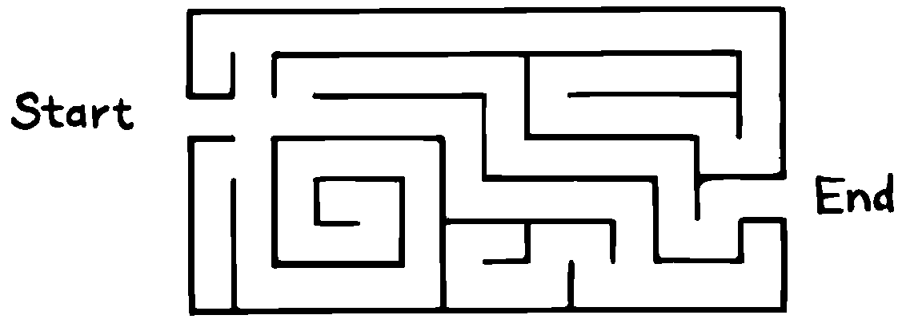
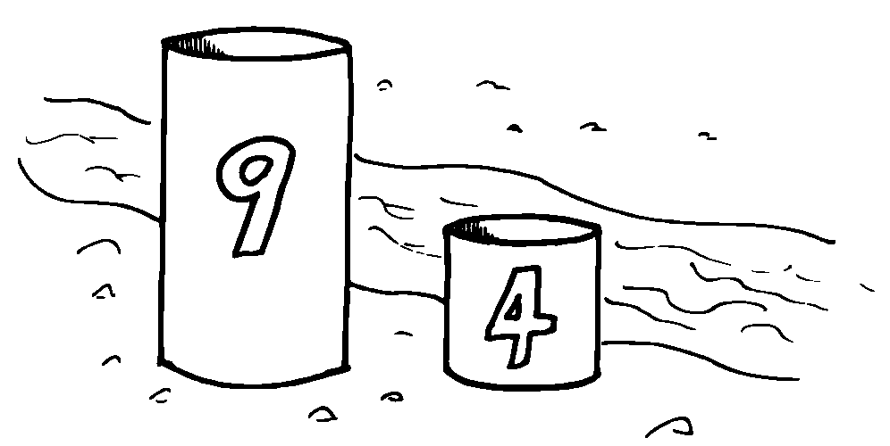
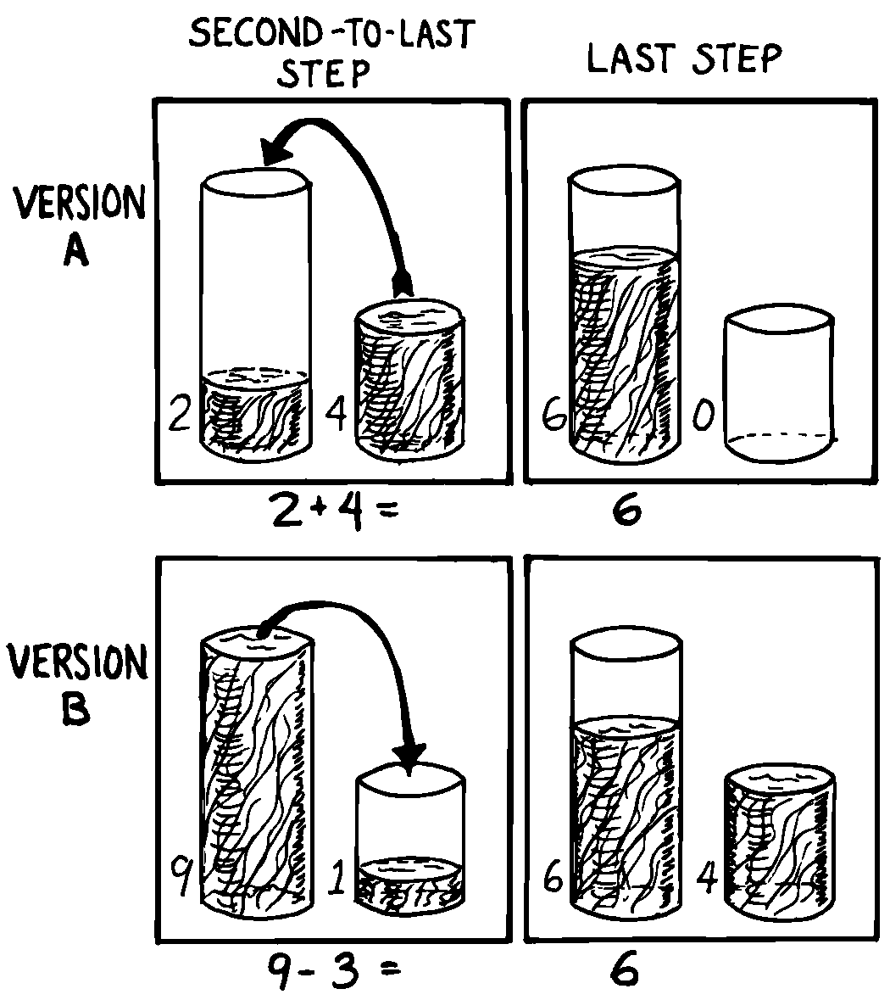
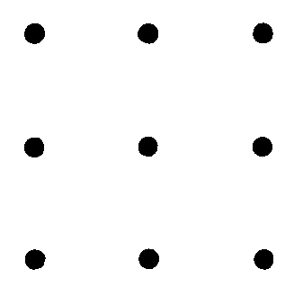
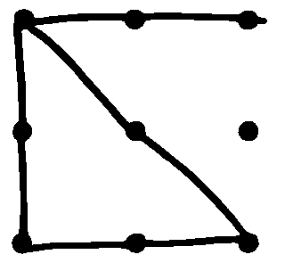
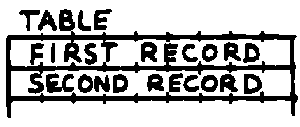
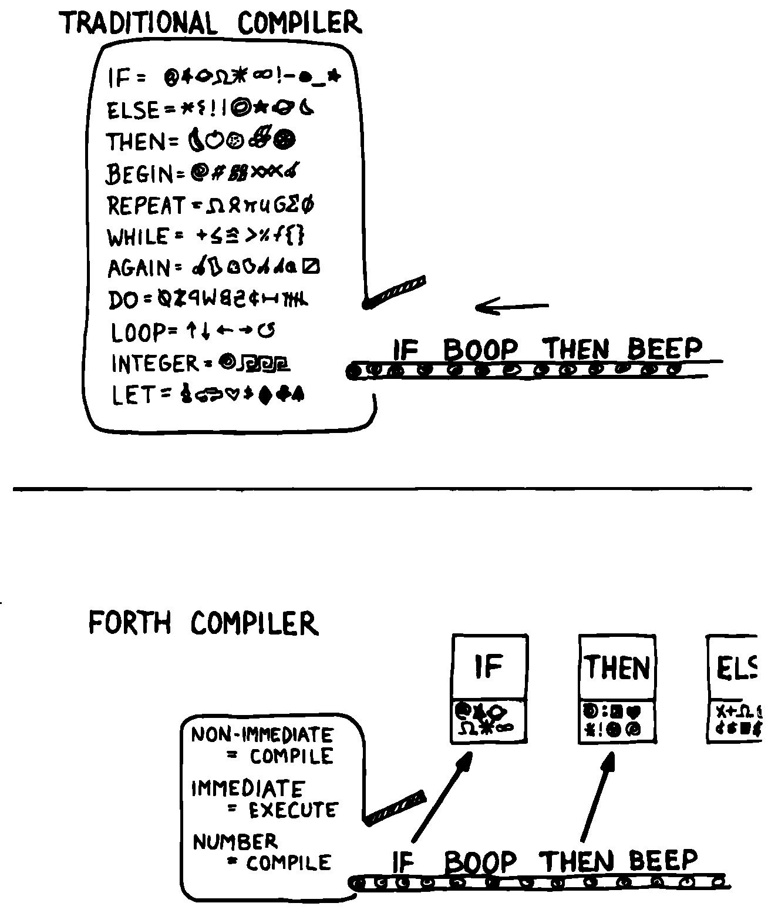
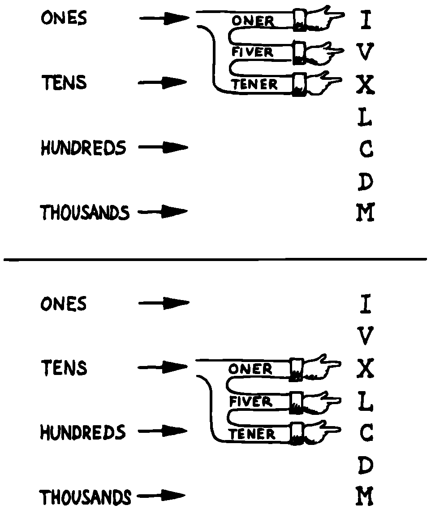

***********************************
4. Detailed Design/0Problem Solving
***********************************
    | **Trivial:** I can see how to do this. I just don't know how long it will take.
    | **Non-trivial:** I haven't a **clue** how to do this!

    | \-\-\- *Operating philosophy developed at the Laboratory*
    | *Automation and Instrumentation Design Group,*
    | *Chemistry Dept., Virginia Polytechnic Institute and State University*

Once you’ve decided upon the components in your
application, your next step is to design those components. In this
chapter we’ll apply problem-solving techniques to the detailed design of
a Forth application. This is the time for pure invention, the part that
many of us find the most fun. There’s a special satisfaction in going to
the mat with a non-trivial problem and coming out the victor.

In English it’s difficult to separate an idea from the words used to
express the idea. In writing a Forth application it’s difficult to
separate the detailed design phase from implementation, because we tend
to design in Forth. For this reason, we’ll get a bit ahead of ourselves
in this chapter by not only presenting a problem but also designing a
solution to it, right on through to the coded implementation.

Problem-Solving Techniques
==========================

Even neophytes can
solve programming problems without devoting any conscious thought to
problem solving techniques. So what’s the point in studying techniques
of problem solving? To quicken the process. By thinking about the *ways*
in which we solve problems, apart from the problems themselves, we
enrich our subconscious storehouse of techniques.

\G. Polya has written several books on problem solving, especially of the
mathematical problem. The most accessible of these is *How to Solve It*
[polya]_ .
Although solving a mathematical problem isn’t quite the same as solving
a software problem, you’ll find some valuable suggestions there.

The following series of tips summarize several techniques recommended by
the science of problem solving:

.. tip::

   Determine your goal.

Know what you’re trying to accomplish. As we saw in
:doc:`Chapter Two<chapter2>`, this
step can be detailed further:

Determine the data
interfaces: Know what data will be required to accomplish the goal, and
make sure those data are available (input). Know what data the function
is expected to produce (output). For a single definition, this means
writing the stack-effect comment.

Determine the rules; review all
the facts that you know. In :doc:`Chapter Two<chapter2>` Two we described
the rates for
computing the cost of a phone call along with the rules for applying the
rates.

.. tip::

   Picture the problem as a whole.

In the *analysis* phase we separated the problem into its parts, to
clarify our understanding of each piece. We are now entering the
*synthesis* phase. We must visualize the problem as a whole.

Try to retain as much information about the problem in your mind as
possible. Use words, phrases, figures and tables, or any kind of graphic
representation of the data and/or rules to help you see the maximum
information at a glance. Fill your mind to bursting with the
requirements of the problem you need to solve, the way you might fill
your lungs with air.

Now hold that mental image, the way you might hold your breath.

One of two things will happen:

You may see the solution in a flash of insight. Great! Exhale a sigh of
relief and proceed directly to implementation. Or…, the problem is too
complex or too unfamiliar to be solved so easily. In this case, you’ll
have to turn your attention to analogies and partial solutions. As you
do so, it’s important that you have already concentrated on the
problem’s requirements all at once, engraving these requirements on your
mental retina.

.. tip::

   Develop a plan.

If the solution didn’t come at a glance, the next step is to determine
the approach that you will take to solve it. Set a course for action and
avoid the trap of fumbling about aimlessly.

The following tips suggest several approaches you might consider.

.. tip::

   Think of an analogous problem.

Does this problem sound familiar? Have you written a definition like it
before? Figure out what parts of the problem are familiar, and in what
ways this problem might differ. Try to remember how you solved it
before, or how you solved something like it.

.. tip::

   Work forward.

The normal, obvious way to attack a problem is by beginning with the
known, and proceeding to the unknown. In deciding which horse to bet on,
you’d begin with their recent histories, their current health, and so
on, apply weights to these various factors and arrive at a favorite.

.. tip::

   Work backward.

More complicated problems present many possible ways to go with the
incoming data. How do you know which route will take you closer to the
solution? You don’t. This class of problem is best solved by working
backward ( :numref:`fig4-1` ).

   A problem that is easier to solve backward than forward.

..

.. tip::

   Believe.

Belief is a necessary ingredient for successfully working backward.
We’ll illustrate with a famous mathematical problem. Suppose we have two
containers. The containers have no graduation marks, but one holds nine
gallons and the other holds four gallons. Our task is to measure out
exactly six gallons of water from the nearby stream in one of the
containers ( :numref:`fig4-2` ).

   Two containers.

..

Try to solve this on your own before reading further.

How can we get a “six” out of a “nine” and a “four”? We can start out
working forward, by mentally
transferring water from one container to the other. For example, if we
fill the large container twice from the small container, we’ll get eight
gallons. If we fill the nine-gallon container to the brim, then empty
enough water to fill the four-gallon container, we’ll have exactly five
gallons in the large container.

These ideas are interesting, but they haven’t gotten us six gallons. And
it’s not clear how they will get us six gallons.

Let’s try working backward. We
assume we’ve measured six gallons of water, and it’s sitting in the
large container (it won’t fit in the small one!). Now, how did we get it
there? What was the state of our containers one step previously?

There are only two possibilities ( :numref:`fig4-3` ):

#. The four-gallon container was full, and we just added it to the large
   container. This implies that we already had two gallons in the large
   container. Or…

#. The nine-gallon container was full, and we just poured off three
   gallons into the small container.

Which choice? Let’s make a guess. The first choice requires a two-gallon
measurement, the second requires a three-gallon measurement. In our
initial playing around, we never saw a unit like two. But we did see a
difference of one, and one from four is three. Let’s go with version b.

Now comes the real trick. We must make ourselves *believe* without doubt
that we have arrived at the situation described. We have just poured off
three gallons into the small container. Suspending all disbelief, we
concentrate on how we did it.

How can we pour off three gallons into the small container? If there had
already been one gallon in the small container! Suddenly we’re over the
hump. The simple question now is, how do we get one gallon in the small
container? We must have started with a full nine-gallon container,
poured off four gallons twice, leaving one gallon. Then we transferred
the one gallon to the small container.

   Achieving the end result.

.. figure:: img4-103.png
   :name: img4-103
   :alt: Intent on a complicated problem.

   Intent on a complicated problem.

Our final step should be to check our logic by running the problem
forwards again.

Here’s another benefit of working
backward: If the problem is
unsolvable, working backward helps you quickly prove that it has no
solution.

.. tip::

   Recognize the auxiliary problem.

Before we’ve solved a problem, we have only a hazy notion of what
steps—or even how many steps—may be required. As we become more familiar
with the problem, we begin to recognize that our problem includes one or
more subproblems that somehow seem different from the main outline of
the proposed procedure.

In the problem we just solved, we recognized two subproblems: filling
the small container with one gallon and then filling the large container
with six gallons.

Recognizing these smaller problems, sometimes called “auxiliary
problems,” is an important
problem-solving technique. By identifying the subproblem, we can assume
it has a straightforward solution. Without stopping to determine what
that solution might be, we forge ahead with our main problem.

(Forth is ideally suited to this technique, as we’ll see.)

.. tip::

   Step back from the problem.

It’s easy to get so emotionally attached to one particular solution that
we forget to keep an open mind.

The literature of problem solving often employs the example of the nine
dots. It stumped me, so I’ll pass it along. We have nine dots arranged
as shown in  :numref:`fig4-4` . The object is to draw straight
lines that touch or pass through all nine dots, without lifting the pen
off the paper. The constraint is that you must touch all nine dots with
only four lines.

   The nine dots problem.

..

You can sit a good while and do no better than the almost-right
:numref:`fig4-5` . If you concentrate really hard, you may
eventually conclude that the problem is a trick—there’s no solution.

   Not quite right.

..

But if you sit back and ask yourself,

    "Am I cheating myself out a useful tack by being narrow-minded? Am I
    assuming any constraints not specified in the problem? What constraints
    might they be?"

then you might think of extending some of the lines beyond the perimeter
of the nine dots.

.. tip::

   Use whole-brain thinking.

When a problem has you stumped and you seem to be getting nowhere,
relax, stop worrying about it, perhaps even forget about it for a while.

Creative people have always noted that their best ideas seem to come out
of the blue, in bed or in the shower. Many books on problem solving
suggest relying on the subconscious for the really difficult problems.

Contemporary theories on brain functions explore the differences between
rational, conscious thought (which relies on the manipulation of
symbols) and subconscious thought (which correlates perceptions to
previously stored information, recombining and relinking knowledge in
new and useful ways).

Leslie Hart
[hart75]_ explains the difficulty of solving a large
problem by means of logic:

    A huge load is placed on that one small function of the brain that can be
    brought into the attention zone for a period. The feat is possible, like
    the circus act, but it seems more sensible to... use the full
    resources of our glorious neocortex... the multibillion-neuron
    capacity of the brain.

    \... The work aspect lies in providing the brain with raw input, as in
    observing, reading, collecting data, and reviewing what others have
    achieved.  Once in, [subconscious] procedures take over, simultaneously,
    automatically, outside of the attention zone.
    
    \... It seems apparent... that a search is going on during the
    interval, though not necessarily continuously, much as in a large
    computer. I would hazard the guess that the search ramifies, starts and
    stops, reaches dead ends and begins afresh, and eventually assembles an
    answer that is evaluated and then popped into conscious attention---often
    in astonishingly full-blown detail.

.. tip::

   Evaluate your solution. Look for other solutions.

You may have found one way of skinning the cat. There may be other ways,
and some of them may be better.

Don’t invest too much effort in your first solution without asking
yourself for a second opinion.

   "I\'m not just sleeping. I\'m using my neocortex."

Interview with a Software Inventor
==================================

**Donald A. Burgess**, owner and president of Scientek Instrumentation, Inc.:
    I have a few techniques I've found useful over the years in designing
    anything, to keep myself flexible.
    My first rule is, "Nothing is impossible."
    My second rule is, "Don't forget, the object is to make a buck."
    
    First examine the problem, laying out two or three approaches on paper.
    Then try the most appealing one, to see if it works. Carry it through. Then
    deliberately go all the way back to the beginning, and start over.
    
    Starting over has two values. First, it gives you a fresh approach. You
    either gravitate back to the way you started, or the way you started
    gravitates toward the new way.
    
    Second, the new approach may show all kinds of powerful possibilities. Now
    you have a benchmark. You can look at both approaches and compare the
    advantages of both. You're in a better position to judge.
    
    Getting stuck comes from trying too hard to follow a single approach.
    Remember to say, "I want this kumquat crusher to be different. Let's
    reject the traditional design as not interesting. Let's try some crazy
    ideas."
    
    The best thing is to start drawing pictures. I draw little men. That keeps
    it from looking like "data" and interfering with my thinking process. The
    human mind works exceptionally well with analogies. Putting things in
    context keeps you from getting stuck within the confines of any language,
    even Forth.
    
    When I want to focus my concentration, I draw on little pieces of paper.
    When I want to think in broad strokes, to capture the overall flow, I draw
    on great big pieces of paper. These are some of the crazy tricks I use to keep
    from getting stagnant.
    
    When I program in Forth, I spend a day just dreaming, kicking around
    ideas. Usually before I start typing, I sketch it out in general terms. No
    code, just talk. Notes to myself.
    
    Then I start with the last line of code first. I describe what I would like
    to do, as close to English as I can. Then I use the editor to slide this
    definition towards the bottom of the screen, and begin coding the internal
    words. Then I realize that's a lousy way to do it. Maybe I split my top word
    into two and transfer one of them to an earlier block so I can use it earlier.
    I run the hardware if I have it; otherwise I simulate it.
    
    Forth requires self-discipline. You have to stop diddling with the
    keyboard. Forth is so willing to do what I tell it to, I'll tell it to
    do all kinds of ridiculous things that have nothing to do with where I'm
    trying to go. At those times I have to get away from the keyboard.
    
    Forth lets you play. That's fine, chances are you'll get some ideas. As
    long as you keep yourself from playing as a habit. Your head is a whole lot
    better than the computer for inventing things.

Detailed Design
===============

We’re now at the point in the development cycle at which we’ve decided
we need a component (or a particular word). The component will consist
of a number of words, some of which (those that comprise the lexicon)
will be used by other components and some of which (the internal words)
will be only used within this component.

Create as many words as necessary to obey the following tip:

.. tip::

   Each definition should perform a simple, well-defined task.

Here are the steps
generally involved in designing a component:

#. Based on the required functions, decide on the names and syntax for
   the external definitions (define the interfaces).

#. Refine the conceptual model by describing the algorithm(s) and data
   structure(s).

#. Recognize auxiliary definitions.

#. Determine what auxiliary definitions and techniques are already
   available.

#. Describe the algorithm with pseudocode.

#. Implement it by working backwards from existing definitions to the
   inputs.

#. Implement any missing auxiliary definitions.

#. If the lexicon contains many names with strong elements in common,
   design and code the commonalities as internal definitions, then
   implement the external definitions.

We’ll discuss the
first two steps in depth. Then we’ll engage in an extended example of
designing a lexicon.

Forth Syntax
============

At this point in the development cycle you must decide how the words in
your new lexicon will be used in context. In doing so, keep in mind how
the lexicon will be used by subsequent components.

.. tip::

   In designing a component, the goal is to create a lexicon that will make your
   later code readable and easy to maintain.

Each component should be designed with components that use it in mind.
You must design the syntax of the lexicon so that the words make sense
when they appear in context. Hiding interrelated information within the
component will ensure maintainability, as we’ve seen.

At the same time, observe Forth’s own syntax. Rather than insisting on a
certain syntax because it seems familiar, you may save yourself from
writing a lot of unnecessary code by choosing a syntax that Forth can
support without any special effort on your part.

Here are some elementary rules of Forth’s natural syntax:

.. tip::

   Let numbers precede names.

Words that require a numeric argument will naturally expect to find that
number on the stack. Syntactically speaking, then, the number should
precede the name. For instance, the syntax of the word SPACES, which
emits “:math:`n`” number of spaces, is

.. code-block:: none
   
   20 SPACES

Sometimes this rule violates the order that our ear is accustomed to
hearing. For instance, the Forth word + expects to be preceded by both
arguments, as in

.. code-block:: none
   
   3 4 +

This ordering, in which values
precede operators, is called “postfix.”

Forth, in its magnanimity, won’t *insist* upon postfix notation. You
could redefine + to expect one number in the input stream, like this:

.. code-block:: none
   
   3 + 4

by defining it so:

.. code-block:: none
   
   : +   BL WORD  NUMBER DROP  + ;

(where ``WORD`` is 79/83 Standard, returning an
address, and ``NUMBER`` returns a double-length value
as in the 83 Standard Uncontrolled Reference Words).

Fine. But you wouldn’t be able to use this definition inside other colon
definitions or pass it arguments, thereby defeating one of Forth’s major
advantages.

Frequently, “noun” type words pass their addresses (or any type of
pointer) as a stack argument to “verb” type words. The Forth-like syntax
of

    “noun” “verb”

   img4-110

will generally prove easiest to implement because of the
stack.

In some cases this word order
sounds unnatural. For instance, suppose we have a file named ``INVENTORY`` .
One thing we can do with that file is ``SHOW`` it; that is, format the
information in pretty columns. If ``INVENTORY`` passes a pointer to ``SHOW`` ,
which acts upon it, the syntax becomes

.. code-block:: none
   
   INVENTORY SHOW

If your spec demands the English
word-order, Forth offers ways to
achieve it. But most involve new levels of complexity. Sometimes the
best thing to do is to choose a better name. How about

.. code-block:: none
   
   INVENTORY REPORT

..

(We’ve made the “pointer” an adjective, and the “actor” a noun.)

If the requirements insist on the syntax

.. code-block:: none
   
   SHOW INVENTORY

we have several options. ``SHOW`` might set a flag and ``INVENTORY`` would act
according to the flag. Such an approach has certain disadvantages,
especially that ``INVENTORY`` must be “smart” enough to know all the
possible actions that might be taken on it. (We’ll treat these problems
in Chapters :doc:`Chapter Seven<chapter7>`
and :doc:`Chapter Eight<chapter8>` .)

Or, ``SHOW`` might look ahead at the next word in the input stream. We’ll
discuss this approach in a tip, “Avoid expectations,” later in this
chapter.

Or, the recommended approach, ``SHOW`` might set an “execution variable”
that ``INVENTORY`` will then execute. (We’ll discuss vectored execution in
:doc:`Chapter Seven<chapter7>`.)

.. tip::

   Let text follow names.

If the Forth interpreter finds a string of text that is neither a number
nor a predefined word, it will abort with an error message. For this
reason, an undefined string must be preceded by a defined word.

An example is ``."`` (dot-quote), which precedes the text it will later
print. Another example is ``CREATE`` (as well as all
defining words), which precedes the name that is, at the moment, still
undefined.

The rule also applies to defined words that you want to refer to, but
not execute in the usual way. An example is ``FORGET`` , as in

.. code-block:: none
   
   FORGET TASK

..

Syntactically, ``FORGET`` must precede ``TASK`` so that
``TASK`` doesn’t execute.

.. tip::

   Let definitions consume their arguments.

This syntax rule is more a convention of good Forth programming than a
preference of Forth.

Suppose you’re writing the word ``LAUNCH``, which requires the number of a
launch pad and fires the appropriate rocket. You want the definition to
look roughly like this:

.. code-block:: none
   
   : LAUNCH  ( pad#)  LOAD  AIM  FIRE ;

Each of the three internal definitions will require the same argument,
the launch pad number. You’ll need two ``DUP`` s
somewhere. The question is where? If you put them inside ``LOAD`` and ``AIM``,
then you can keep them out of ``LAUNCH``, as in the definition above. If you
leave them out of ``LOAD`` and ``AIM``, you’ll have to define:

.. code-block:: none
   
   : LAUNCH  ( pad#)  DUP LOAD  DUP AIM  FIRE ;

By convention, the latter version is preferable, because ``LOAD`` and ``AIM``
are cleaner. They do what you expect them to do. Should you have to
define ``READY``, you can do it so:

.. code-block:: none
   
   : READY  ( pad#)  DUP LOAD  AIM ;

and not

.. code-block:: none
   
   : READY  ( pad#)  LOAD  AIM  DROP ;

.. tip::

   Use zero-relative numbering.

By habit we humans number things starting with one: “first, second,
third,” etc. Mathematical models, on the other hand, work more naturally
when starting with zero.
ince computers are numeric processors, software becomes easier to
write when we use zero-relative numbering.

To illustrate, suppose we have a table of eight-byte records. The first
record occupies the first eight bytes of the table. To compute its
starting address, we add “0” to ``TABLE``. To compute the starting address
of the “second” record, we add “8” to ``TABLE``.

   A table of 8-byte records.

It’s easy to derive a formula to achieve these results: 

.. list-table::
   :widths: auto

   * - first record starts at:
     - 0 × 8 =
     - 0
   * - second record starts at:
     - 1 × 8 =
     - 8
   * - third record starts at:
     - 2 × 8 =
     - 16

We can easily write a word which converts a
record# into the address where that record begins:

.. code-block:: none
   
   : RECORD  ( record# -- adr )
      8 *  TABLE + ;

Thus in computer terms it makes sense to call the “first record” the 0th
record.

If your requirements demand that numbering start at one, that’s fine.
Use zero-relative numbering throughout your design and then, only in the
“user lexicons” (the set of words that the end-user will use) include
the conversion from zero-to one-relative numbering:

.. code-block:: none
   
   : ITEM  ( n -- adr)  1- RECORD ;

..

.. tip::

   Let addresses precede counts.

Again, this is a convention, not a requirement of Forth, but such
conventions are essential for readable code. You’ll find examples of
this rule in the words ``TYPE``, ``ERASE``, and ``BLANK``.

.. tip::

   Let sources precede destinations.

Another convention for readability. For instance, in some systems, the
phrase

.. code-block:: none
   
   22 37 COPY

copies Screen 22 to Screen 37. The syntax of ``CMOVE`` incorporates both
this convention and the previous convention:

.. code-block:: none
   
   source destination count CMOVE

.. tip::

   Avoid expectations (in the input stream).

Generally try to avoid creating words that presume there will be other
words in the input stream.

Suppose your color computer represents blue with the value 1, and
light-blue with 9. You want to define two words: ``BLUE`` will return 1;
``LIGHT`` may precede ``BLUE`` to produce 9.

In Forth, it would be possible to define ``BLUE`` as a constant, so that
when executed it always returns 1.

.. code-block:: none
   
   1 CONSTANT BLUE

And then define ``LIGHT`` such that it looks for the next word in the input
stream, executes it, and “ors” it with 8 (the logic of this will become
apparent when we visit this example again, later in the book):

.. code-block:: none
   
   : LIGHT  ( precedes a color)  ( -- color value)
        ' EXECUTE  8 OR ;

(in fig-Forth:

.. code-block:: none
   
   : LIGHT [COMPILE] '  CFA EXECUTE  8 OR ;&textrm{)}

(For novices: The apostrophe in the definition of
``LIGHT`` is a Forth word called “tick.” Tick is a dictionary-search word;
it takes a name and looks it up in the dictionary, returning the address
where the definition resides. Used in this definition, it will find the
address of the word following ``LIGHT`` —for instance, ``BLUE`` —and pass this
address to the word ``EXECUTE``, which will execute
``BLUE``, pushing a one onto the stack. Having “sucked up” the operation of
``BLUE``, ``LIGHT`` now “or”s an 8 into the 1, producing a 9.)

This definition will work when invoked in the input stream, but special
handling is required if we want to let ``LIGHT`` be invoked within a colon
definition, as in:

.. code-block:: none
   
   : EDITING   LIGHT BLUE BORDER ;

Even in the input stream, the use of ``EXECUTE`` here will cause a crash if
``LIGHT`` is accidentally followed by something other than a defined word.

The preferred technique, if you’re forced to use this particular syntax,
is to have ``LIGHT`` set a flag, and have ``BLUE`` determine whether that flag
was set, as we’ll see later on.

There will be times when looking ahead in the input stream is desirable,
even necessary. (The proposed ``TO`` solution is often implemented this way
[rosen82]_.)

But generally, avoid expectations. You’re setting yourself up for
disappointment.

.. tip::

   Let commands perform themselves.

This rule is a corollary to “Avoid
expectations.” It’s one of Forth’s philosophical quirks to let words do
their own work. Witness the Forth compiler (the function that compiles
colon definitions), caricatured in  :numref:`fig4-7` . It has
very few rules:

   The traditional compiler vs. the Forth compiler.

-  Scan for the next word in the input stream and look it up in the
   dictionary.

-  If it’s an ordinary word, *compile* its address.

-  If it’s an “immediate” word, *execute* it.

-  If it’s not a defined word, try to convert it to a number and compile
   it as a literal.

-  If it’s not a number, abort with an error message.

Nothing is mentioned about compiling-words such as ``IF``, ``ELSE``,
``THEN``, etc. The colon compiler doesn’t know about
these words. It merely recognizes certain words as “immediate” and
executes them, letting them do their own work. (See *Starting Forth*,
Chapter Eleven, “How to Control the Colon Compiler.”)

The compiler doesn’t even “look for” semicolon to know when to stop
compiling. Instead it *executes* semicolon, allowing it to do the work
of ending the definition and shutting off the compiler.

There are two tremendous advantages to this approach. First, the
compiler is so simple it can be written in a few lines of code. Second,
there’s no limit on the number of compiling words you can add at any
time, simply by making them immediate. Thus, even Forth’s colon compiler
is extensible!

Forth’s text interpreter and
Forth’s address interpreter also adhere to this same rule.

The following tip is perhaps the most important in this chapter:

.. tip::

   Don't write your own interpreter/compiler when you can use {Forth}{}'s.

One class of applications answers a need for a special purpose
language—a self-contained set of commands for doing one particular
thing. An example is a machine-code assembler. Here you have a large
group of commands, the mnemonics, with which you can describe the
instructions you want assembled. Here again, Forth takes a radical
departure from mainstream philosophy.

Traditional assemblers are
special-purpose interpreters—that is, they are complicated programs that
scan the assembly-language listing looking for recognized mnemonics such
as ADD, SUB, JMP, etc., and assemble machine instructions
correspondingly. The Forth assembler, however, is merely a lexicon of
Forth words that themselves assemble machine instructions.

There are many more examples of the special purpose language, each
specific to individual applications. For instance:

#. If you\’re building an Adventure-type game, you\’d want to write a
   language that lets you create and describe monsters and rooms, etc.
   You might create a defining word called ``ROOM`` to be used like this:
   
   .. code-block:: none
   
      ROOM DUNGEON

   Then create a set of words to describe the room\’s attributes by
   building unseen data structures associated with the room:

   .. code-block:: none
   
      EAST-OF DRAGON-LAIR
      WEST-OF BRIDGE
      CONTAINING POT-O-GOLD
      etc.

   The commands of this game-building language can simply be Forth
   words, with Forth as the interpreter.

#. If you’re working with Programmable Array Logic (PAL) devices,
   you’d like a
   form of notation that lets you describe the behavior of the output
   pins in logical terms, based on the states of the input pins. A PAL
   programmer was written with wonderful simplicity in Forth by Michael
   Stolowitz [stolowitz82]_ .

#. If you must create a series of user menus to drive your application,
   you might want to first develop a menu-compiling language. The words
   of this new language allow an application programmer to quickly
   program the needed menus—while hiding information about how to draw
   borders, move the cursor, etc.

All of these examples can be coded in Forth as lexicons, using the
normal Forth interpreter, without having to write a special-purpose
interpreter or compiler. 

**Moore**:
    A simple solution is one that does not obscure the problem with
    irrelevancies.  It\'s conceivable that something about the problem
    requires
    
    a unique interpreter. But every time you see a unique interpreter, it
    implies that there is something particularly awkward about the problem.
    And that is almost never the case.

    If you write your own interpreter, the interpreter is almost certainly the
    most complex, elaborate part of your entire application. You have switched
    from solving a problem to writing an interpreter.
    
    I think that programmers like to write interpreters. They like to do these
    elaborate difficult things. But there comes a time when the world is going
    to have to quit programming keypads and converting numbers to binary,
    and start solving problems.

Algorithms and Data Structures
==============================

In :doc:`Chapter Two<chapter2>` we learned how to describe a problem\’s
requirements in
terms of interfaces and rules. In this section we\’ll refine the
conceptual model for each component into clearly defined algorithms and
data structures.

An algorithm is a procedure, described as a finite number of rules, for
accomplishing a certain task. The rules must be unambiguous and
guaranteed to terminate after a finite number of applications. (The word
is named for the ninth century Persian mathematician al-Khowarizmi.)

An algorithm lies halfway between the imprecise directives of human
speech, such as “Please sort these letters chronologically,” and the
precise directives of computer language, such as ``BEGIN 2DUP < IF …``
etc. The algorithm for sorting letters chronologically might be this:

#. Take an unsorted letter and note its date.

#. Find the correspondence folder for that month and year.

#. Flip through the letters in the folder, starting from the front,
   until you find the first letter dated later than your current letter.

#. Insert your current letter just in front of the letter dated later.
   (If the folder is empty, just insert the letter.)

There may be several possible algorithms for the same job. The algorithm
given above would work fine for folders containing ten or fewer letters,
but for folders with a hundred letters, you’d probably resort to a more
efficient algorithm, such as this:

#. (same)

#. (same)

#. If the date falls within the first half of the month, open the folder
   a third of the way in. If the letter you find there is dated later
   than your current letter, search forward until you find a letter
   dated the same or before your current letter. Insert your letter at
   that point. If the letter you find is dated earlier than your current
   letter, search backward…

… You get the point. This second algorithm is more complicated than the
first. But in execution it will require fewer steps on the average
(because you don’t have to search clear from the beginning of the folder
every time) and therefore can be performed faster.

A data structure is an
arrangement of data or locations for data, organized especially to match
the problem. In the last example, the file cabinet containing folders
and the folders containing individual letters can be thought of as data
structures.  The new
conceptual model includes the filing cabinets and folders (data
structures) plus the steps for doing the filing (algorithms).

Calculations vs. Data Structures vs. Logic
==========================================

We’ve stated before that the best solution to a problem is the simplest
adequate one; for any problem we should strive for the simplest
approach.

Suppose we must write code to fulfill this specification:

.. code-block:: none
   
   if the input argument is 1, the output is 10
   if the input argument is 2, the output is 12
   if the input argument is 3, the output is 14

There are three approaches we could take:

Calculation
    .. code-block:: none
       
       ( n)  1-  2*  10 +

Data Structure
    .. code-block:: none
   
       CREATE TABLE  10 C,  12 C,  14 C,
       ( n)  1- TABLE + C@

Logic
    .. code-block:: none
   
       ( n)  CASE
                1 OF 10 ENDOF
                2 OF 12 ENDOF
                3 OF 14 ENDOF  ENDCASE

In this problem, calculation is simplest. Assuming it is also adequate
(speed is not critical), calculation is best.

The problem of converting angles to sines and cosines can be implemented
more simply (at least in terms of lines of code and object size) by
calculating the answers than by using a data structure. But for many
applications requiring trig, it’s faster to look up the answer in a
table stored in memory. In this case, the simplest *adequate* solution
is using the data structure.

In :doc:`Chapter Two<chapter2>` we introduced the telephone rate problem.
In that problem
the rates appeared to be arbitrary, so we designed a data structure:

+---------------+---------------+----------------+-----------------+
|               | Full Rate     | Lower Rate     | Lowest Rate     |
+===============+===============+================+=================+
| First Min.    | .30           | .22            | .12             |
+---------------+---------------+----------------+-----------------+
| Add’1 Mins.   | .12           | .10            | .06             |
+---------------+---------------+----------------+-----------------+

Using a data structure was simpler than trying to
invent a formula by which these values could be calculated. And the
formula might prove wrong later. In this case, table-driven code is
easier to maintain.

In :doc:`Chapter Three<chapter3>` we designed a keystroke interpreter for
our Tiny Editor
using a decision table:

.. list-table::
   :header-rows: 1

   * - Key
     - Not-Inserting
     - Inserting
   * - Ctrl-D
     - DELETE
     - INSERT-OFF
   * - Ctrl-I
     - INSERT-ON
     - INSERT-OFF
   * - backspace
     - BACKWARD
     - INSERT<
   * - etc.
     -
     -

We could have achieved this
same result with logic:

.. code-block:: none
   
   CASE
      CTRL-D     OF  'INSERTING @  IF
         INSERT-OFF   ELSE DELETE     THEN   ENDOF
      CTRL-I     OF  'INSERTING @  IF
         INSERT-OFF   ELSE INSERT-ON  THEN   ENDOF
      BACKSPACE  OF  'INSERTING @  IF
         INSERT<      ELSE BACKWARD   THEN   ENDOF
   ENDCASE

but the logic is more confusing. And the use of logic to express such a
multi-condition algorithm gets even more convoluted when a table was not
used in the original design.

The use of logic becomes advisable when the result is not calculable, or
when the decision is not complicated enough to warrant a decision table.
:doc:`Chapter Eight<chapter8>` is devoted to the issue of minimizing the
use of logic in your programs.

.. tip::

   In choosing which approach to apply towards solving a problem, give
   preference in the following order:

   #. calculation (except when speed counts)
   #. data structures
   #. logic

Of course, one nice feature of modular languages such as Forth is that
the actual implementation of a component—whether it uses calculation,
data structures, or logic—doesn’t have to be visible to the rest of the
application.

Solving a Problem: Computing Roman Numerals
===========================================

In this section we’ll attempt to demonstrate the process of designing a
lexicon. Rather than merely present the problem and its solution, I’m
hoping we can crack this problem together. (I kept a record of my
thought processes as I solved this problem originally.) You’ll see
elements of the problem-solving guidelines previously given, but you’ll
also see them being applied in a seemingly haphazard order—just as they
would be in reality.

Here goes: The problem is to write a definition that consumes a number
on the stack and displays it as a Roman numeral.

This problem most likely represents a component of a larger system.
We’ll probably end up defining several words in the course of solving
this problem, including data structures. But this particular lexicon
will include only one name, ROMAN, and it will take its argument from
the stack. (Other words will be internal to the component.)

Having thus decided on the external syntax, we can now proceed to devise
the algorithms and data structures.

We’ll follow the scientific method—we’ll observe reality, model a
solution, test it against reality, modify the solution, and so on. We’ll
begin by recalling what we know about Roman numerals.

Actually, we don’t remember any formal rules about Roman numerals. But
if you give us a number, we can make a Roman numeral out of it. We know
how to do it—but we can’t yet state the procedure as an algorithm.

So, let’s look at the first ten Roman numerals:

| I
| II
| III
| IV
| V
| VI
| VII
| VIII
| IX
| X

We make a few observations. First, there’s the
idea of a tally, where we represent a number by making that many marks
(3 = III). On the other hand, special symbols are used to represent
groups (5 = V). In fact, it seems we can’t have more than three I’s in a
row before we use a larger symbol.

Second, there’s a symmetry around five. There’s a symbol for five (V),
and a symbol for ten (X). The pattern I, II, III repeats in the second
half, but with a preceding V.

One-less-than-five is written IV, and one-less-than-ten is written IX.
It seems that putting an “I” in front of a larger-value symbol is like
saying “one-less-than…”

These are vague, hazy observations. But that’s alright. We don’t have
the whole picture yet.

Let’s study what happens above ten:

| XI
| XII
| XIII
| XIV
| XV
| XVI
| XVII
| XVIII
| XIX
| XX

This is exactly the pattern
as before, with an extra “X” in front. So there’s a repeating cycle of
ten, as well.

If we look at the twenties, they’re the same, with two “X”s; the
thirties with three “X”s. In fact, the number of “X” is the same as the
number in the tens column of the original decimal number.

This seems like an important observation: we can decompose our decimal
number into decimal digits, and treat each digit separately. For
instance, 37 can be written as

    XXX (thirty)

followed by

    VII (seven)

It may be premature, but we can already see a
method by which Forth will let us decompose a number into decimal
digits—with modulo division by ten. For instance, if we say

.. code-block:: none
   
   37 10 /MOD

we’ll get a 7 and a 3 on the stack (the three—being the quotient—is on
top.)

But these observations raise a question: What about below ten, where
there is no ten’s place? Is this a special case? Well, if we consider
that each “X” represents ten, then the absence of “X” represents zero.
So it’s *not* a special case. Our algorithm works, even for numbers less
than ten.

Let’s continue our observations, paying special attention to the cycles
of ten. We notice that forty is “XL.” This is analogous to 4 being “IV,”
only shifted by the value of ten. The “X” before the “L” says
“ten-less-than-fifty.” Similarly,

.. csv-table::
   :widths: auto
   
   "L",    50,  "is analogous to", "V",    5
   "LX",   60,  "is analogous to", "VI",   6
   "LXX",  70,  "is analogous to", "VII",  7
   "LXXX", 80,  "is analogous to", "VIII", 8
   "XC",   90,  "is analogous to", "IX",   9
   "C",    100, "is analogous to", "X",    10

Apparently the same patterns apply for any decimal
digit—only the symbols themselves change. Anyway, it’s clear now that
we’re dealing with an essentially decimal system.

If pressed to do so, we could even build a model for a system to display
Roman numerals from 1 to 99, using a combination of algorithm and data
structure.

Data Structure
--------------

+---+---------+------+---+---------+
| One`s Table |      | Ten`s Table |  
+---+---------+------+---+---------+
| 0 |         |      | 0 |         |
+---+---------+------+---+---------+
| 1 |       I |      | 1 |       X |
+---+---------+------+---+---------+
| 2 |      II |      | 2 |      XX |
+---+---------+------+---+---------+
| 3 |     III |      | 3 |     XXX |
+---+---------+------+---+---------+
| 4 |      IV |      | 4 |      XL |
+---+---------+------+---+---------+
| 5 |       V |      | 5 |       L |
+---+---------+------+---+---------+
| 6 |      VI |      | 6 |      LX |
+---+---------+------+---+---------+
| 7 |     VII |      | 7 |     LXX |
+---+---------+------+---+---------+
| 8 |    VIII |      | 8 |    LXXX |
+---+---------+------+---+---------+
| 9 |      IX |      | 9 |      XC |
+---+---------+------+---+---------+

Algorithm
---------

Divide :math:`n` by 10. The quotient is the tens’ column digit; the
remainder is the ones’ column digit. Look up the ten’s digit in the
tens’ table and print the corresponding symbol pattern. Look up the
ones’ digit in the one’s table and print that corresponding symbol
pattern.

For example, if the number is 72, the quotient is 7, the remainder is 2.
7 in the tens’ table corresponds to “LXX,” so print that. 2 in the ones’
column corresponds to “II,” so print that. The result:

    LXXII

We’ve just constructed a model that works for numbers from one to 99.
Any higher number would require a hundreds’ table as well, along with an
initial division by 100.

The logical model just described might be satisfactory, as long as it
does the job. But somehow it doesn’t seem we’ve fully solved the
problem. We avoided figuring out how to produce the basic pattern by
storing all possible combinations in a series of tables. Earlier in this
chapter we observed that calculating an answer, if it’s possible, can be
easier than using a data structure.

Since this section deals with devising
algorithms, let’s go all the way. Let’s
look for a general algorithm for producing any digit, using only the
elementary set of symbols. Our data structure should contain only this
much information:

.. list-table::

   * - I
     -
     - V
   * - X
     -
     - L
   * - C
     -
     - D
   * - M
     -
     -

In listing the symbols, we’ve also *organized*
them in a way that seems right. The symbols in the left column are all
multiples of ten; the symbols in the right column are multiples of five.
Furthermore, the symbols in each row have ten times the value of the
symbols directly above them.

Another difference, the symbols in the first column can all be combined
in multiples, as “XXXIII.” But you can’t have multiples of any of the
right-column symbols, such as VVV. Is this observation useful? Who
knows?

Let’s call the symbols in the left column ONERS and in the right column
FIVERS. The ONERS represent the values 1, 10, 100, and 1,000; that is,
the value of one in every possible decimal place. The FIVERS represent
5, 50, and 500; that is, the value of five in every possible decimal
place.

Using these terms, instead of the symbols themselves, we should be able
to express the algorithm for producing
any digit. (We’ve factored out the actual symbols from the *kind* of
symbols.) For instance, we can state the following preliminary
algorithm:

    For any digit, print as many ``ONERS`` as necessary to add up to the
    value.

Thus, for 300 we get “CCC,” for 20 we get “XX” for one we get “I.” And
for 321 we get “CCCXXI.”

This algorithm works until the digit is 4. Now we’ll have to expand our
algorithm to cover this exception:

    Print as many ``ONERS`` as necessary to add up to the value, but if
    the digit is 4, print a ``ONER`` then a ``FIVER``.
    Hence, 40 is "XL"; 4 is "IV."

This new rule works until the digit is 5. As we noticed before, digits
of five and above begin with a ``FIVER`` symbol. So we expand our rule
again:

    If the digit is 5 or more, begin with a ``FIVER`` and subtract five
    from the value; otherwise do nothing. Then print as many ``ONERS`` as
    necessary to add up to the value. But if the digit is 4, print only a
    ``ONER`` and a ``FIVER``.

This rule works until the digit is 9. In this case, we must print a ``ONER``
preceding a—what? A ``ONER`` from the next higher decimal place (the next
row below). Let’s call this a ``TENER``. Our complete model, then is:

    If the digit is 5 or more, begin with a ``FIVER`` and subtract five
    from the value; otherwise do nothing. Then, print as many ``ONERS`` as
    necessary to add up to the value. But if the digit is 4, print only a
    ``ONER`` and a ``FIVER``, or if it's 9, print only a ``ONER``
    and a ``TENER``.

We now have an English-language
version of our algorithm. But we still have some steps to go before we
can run it on our computer.

In particular, we have to be more specific about the exceptions. We
can’t just say,

    Do a, b, and c. **But** in such and such a case, do something different.

because the computer will do a, b, and c before it knows any better.

Instead, we have to check whether the exceptions apply *before* we do
anything else.

.. tip::

   In devising an algorithm, consider exceptions last. In writing code, handle
   exceptions first.

This tells us something about the general structure of our
digit-producing word. It will have to begin with a test for the 4/9
exceptions. In either of those cases, it will respond accordingly. If
neither exception applies, it will follow the “normal” algorithm. Using
pseudocode, then:

.. code-block:: none
   
   : DIGIT  ( n )  4-OR-9? IF  special cases
      ELSE  normal case  THEN ;

An experienced Forth programmer would not actually write out this
pseudocode, but would more likely form a mental image of the structure
for eliminating the special cases. A less experienced programmer might
find it helpful to capture the structure in a diagram, or in code as
we’ve done here. 

In Forth we try to minimize our dependence on logic. But in this case we
need the conditional ``IF`` because we have an
exception we need to eliminate. Still, we’ve minimized the complexity of
the control structure by limiting the number of
``IF``  ``THEN`` s in this definition to one.

Yes, we still have to distinguish between the 4-case and the 9-case, but
we’ve deferred that structural dimension to lower-level definitions—the
test for 4-or-9 and the “special case” code.

What our structure really says is that either the 4-exception or the
9-exception must prohibit execution of the normal case. It’s not enough
merely to test for each exception, as in this version:

.. code-block:: none
   
   : DIGIT  ( n )  4-CASE? IF  ONER FIVER  THEN
                   9-CASE? IF  ONER TENER  THEN
                   normal case... ;

because the normal case is never excluded. (There’s no way to put an
``ELSE`` just before the normal case, because
``ELSE`` must appear between ``IF`` and ``THEN``.)

If we insist on handling the 4-exception and the 9-exception separately,
we could arrange for each exception to pass an additional flag,
indicating that the exception occurred. If either of these flags is
true, then we can exclude the normal case:

.. code-block:: none
   
   : DIGIT  ( n )  4-CASE? &poorbf{DUP} IF  ONER FIVER  THEN
                   9-CASE? &poorbf{DUP} IF  ONER TENER  THEN
                   OR  NOT IF normal case THEN ;

But this approach needlessly complicates the definition by adding new
control structures. We’ll leave it like it was.

Now we have a general idea of the structure of our main definition.

We stated, “If the digit is 5 or more, begin with a ``FIVER`` and subtract
five from the value; otherwise do nothing. Then, print as many ``ONERS`` as
necessary to add up to the value.”

A direct translation of these rules into Forth would look like this:

.. code-block:: none
   
   ( n)  DUP  4 > IF  FIVER 5 -  THEN  ONERS

This is technically correct, but if we’re familiar with the technique of
modulo division, we’ll see this as a natural situation for modulo
division by 5. If we divide the number by five, the quotient will be
zero (false) when the number is less than five, and one (true) when it’s
between 5 and 9. We can use it as the boolean flag to tell whether we
want the leading ``FIVER`` :

.. code-block:: none
   
   ( n )  5 / IF FIVER THEN ...

The quotient/flag becomes the argument to ``IF``.

Furthermore, the remainder of modulo 5 division is always a number
between 0 and 4, which means that (except for our exception) we can use
the remainder directly as the argument to ONERS. We revise our phrase to

.. code-block:: none
   
   ( n )  5 &poorbf{/MOD} IF FIVER THEN  &poorbf{ONERS}

Getting back to that exception, we now see that we can test for both 4
and 9 with a single test—namely, if the remainder is 4. This suggests
that we can do our 5 ``/MOD`` first, then test for the
exception. Something like this:

.. code-block:: none
   
   : DIGIT  ( n )
        5 /MOD  &poorbf{OVER 4 =  IF  special case  ELSE}
        IF FIVER THEN  ONERS  THEN ;

(Notice that we ``OVER`` ed the remainder so that we
could compare it with 4 without consuming it.)

So it turns out we *do* have a doubly-nested
``IF THEN`` construct after all. But it seems
justified because the ``IF THEN`` is handling the
special case. The other is such a short phrase, ``IF FIVER THEN`` ", it’s
hardly worth making into a separate definition. You could though. (But
we won’t.)

Let’s focus on the code for the special case. To state its algorithm:
“If the digit is four, print a ``ONER`` and a ``FIVER``. If the digit is nine,
print a ``ONER`` and a ``TENER``.”

We can assume that the digit will be one or the other, or else we’d
never be executing this definition. The question is, how do we tell
which one?

Again, we can use the quotient of division by five. If the quotient is
zero, the digit must have been four; otherwise it was nine. So we’ll
play the same trick and use the quotient as a boolean flag. We’ll write:

.. code-block:: none
   
   : ALMOST  ( quotient )
        IF  ONER TENER  ELSE  ONER FIVER  THEN ;

In retrospect, we notice that we’re printing a ``ONER`` either way. We can
simplify the definition to:

.. code-block:: none
   
   : ALMOST  ( quotient )
        ONER  IF TENER ELSE FIVER THEN ;

We’ve assumed that we have a quotient on the stack to use. Let’s go back
to our definition of ``DIGIT`` and make sure that we do, in fact:

.. code-block:: none
   
   : DIGIT  ( n )
        5 /MOD  OVER 4 =  IF  &poorbf{ALMOST}  ELSE
        IF FIVER THEN  ONERS  THEN ;

It turns out that we have not only a quotient, but a remainder
underneath as well. We’re keeping both on the stack in the event we
execute the ``ELSE`` clause. The word
``ALMOST``, however, only needs the quotient. So, for
symmetry, we must ``DROP`` the remainder like this:

.. code-block:: none
   
   : DIGIT  ( n )
        5 /MOD  OVER 4 =  IF  ALMOST  &poorbf{DROP}  ELSE
        IF FIVER THEN  ONERS  THEN ;

There we have the complete, coded definition for producing a single
digit of a Roman numeral. If we were desperate to try it out before
writing the needed auxiliary definitions, we could very quickly define a
lexicon of words to print one group of symbols, say the ``ONES`` row:

.. code-block:: none
   
   : ONER    ." I" ;
   : FIVER   ." V" ;
   : TENER   ." X" ;
   : ONERS  ( # of oners -- )
        ?DUP IF 0 DO  ONER  LOOP  THEN ;

before loading our definitions of ``ALMOST`` and ``DIGIT``.

But we’re not that desperate. No, we’re anxious to move on to the
problem of defining the words ``ONER``, ``FIVER``, and ``TENER`` so that their
symbols depend on which decimal digit we’re formatting.

Let’s go back to the symbol table we drew earlier:

========= ===== ======	  
          ONERs FIVERs
========= ===== ======	  
     ones   I     V
     tens   X     L
 hundreds   C     D
thousands   M
========= ===== ======	  

We’ve observed that we also need a ``TENER`` —which
is the ``ONER`` in the next row below. It’s as if the table should really be
written:

But that seems redundant. Can we avoid it? Perhaps
if we try a different model, perhaps a linear table, like this:

========= ===
ones       I
           V
tens       X
           L
hundreds   C
           D
thousands  M
========= ===

Now we can imagine that each column name (“ones,”
“tens,” etc.) points to the ONER of that column. From there we can also
get each column’s ``FIVER`` by reaching down one slot below the current
``ONER``, and the ``TENER`` by reaching down two slots.

It’s like building an arm with three hands. We can attach it to the ``ONES``
column, as in  :numref:`fig4-8` a, or we can attach it to the
tens’ column, as in  :numref:`fig4-8` b, or to any power of ten.

   A mechanical representation: accessing the data structure.

An experienced Forth programmer is not likely to imagine arms, hands, or
things like that. But there must be a strong mental image—the stuff of
right-brain thinking—before there’s any attempt to construct the model
with code.

Beginners who are learning to think in this right-brain way might find
the following tip helpful:

.. tip::

   If you have trouble thinking about a conceptual model,
   visualize it---or draw it---as a mechanical device.

Our table is simply an array of characters. Since a character requires
only a byte, let’s make each “slot” one byte. We’ll call the table
``ROMANS``:

.. code-block:: none
   
   CREATE ROMANS    ( ones)  ASCII I  C,   ASCII V  C,
                    ( tens)  ASCII X  C,   ASCII L  C,
                ( hundreds)  ASCII C  C,   ASCII D  C,
               ( thousands)  ASCII M  C,

Note: This use of ``ASCII`` requires that
``ASCII`` be “ ``STATE`` -dependent”
(see :doc:`Appendix C<appendixc>`). If the word ``ASCII`` is
not defined in your system, or if it is not state-dependent, use:

.. code-block:: none
   
   CREATE ROMANS  73 C,  86 C,  88 C,  76 C,
      67 C,  68 C,  77 C,

We can select a particular symbol from the table by applying two
different offsets at the same time. One dimension represents the decimal
place: ones, tens, hundreds, etc. This dimension is made “current,” that
is, its state stays the same until we change it.

The other dimension represents the kind of symbol we want— ``ONER``, ``FIVER``,
``TENER`` —within the current decimal column. This dimension is incidental,
that is, we’ll specify which symbol we want each time.

Let’s start by implementing the “current” dimension. We need some way to
point to the current decimal column. Let’s create a variable called
``COLUMN#`` (pronounced “column-number”) and have it contain an offset into
the table:

.. code-block:: none
   
   VARIABLE COLUMN#  ( current offset)
   : ONES        O COLUMN# ! ;
   : TENS        2 COLUMN# ! ;
   : HUNDREDS    4 COLUMN# ! ;
   : THOUSANDS   6 COLUMN# ! ;

Now we can find our way to any “arm position” by adding the contents of
``COLUMN#`` to the beginning address of the table, given by ``ROMANS``:

.. code-block:: none
   
   : COLUMN  ( -- adr-of-column)  ROMANS  COLUMN# @  + ;

Let’s see if we can implement one of the words to display a symbol.
We’ll start with ``ONER``.

The thing we want to do in ONER is ``EMIT`` a character.

.. code-block:: none
   
   : ONER                   EMIT ;

Working backward, ``EMIT`` requires the ASCII
character on the stack. How do we get it there? With ``C@``.

.. code-block:: none
   
   : ONER                C@ EMIT ;

``C@`` requires the *address* of the slot that
contains the symbol we want. How do we get that address?

The ``ONER`` is the first “hand” on the movable arm—the position that ``COLUMN``
is already pointing to. So, the address we want is simply the address
returned by ``COLUMN``:

.. code-block:: none
   
   : ONER   COLUMN       C@ EMIT ;

Now let’s write ``FIVER``. It computes the same slot address, then adds one
to get the next slot, before fetching the symbol and emitting it:

.. code-block:: none
   
   : FIVER  COLUMN 1+    C@ EMIT ;

And ``TENER`` is:

.. code-block:: none
   
   : TENER  COLUMN 2+    C@ EMIT ;

These three definitions are redundant. Since the only difference between
them is the incidental offset, we can factor the incidental offset out
from the rest of the definitions:

.. code-block:: none
   
   : .SYMBOL  ( offset)  COLUMN +  C@ EMIT ;

Now we can define:

.. code-block:: none
   
   : ONER    O .SYMBOL ;
   : FIVER   1 .SYMBOL ;
   : TENER   2 .SYMBOL ;

All that remains for us to do now is to decompose our complete decimal
number into a series of decimal digits. Based on the observations we’ve
already made, this should be easy.  :numref:`fig4-9`  shows our
completed listing.

Voila! From problem, to conceptual model, to code.

Note: this solution is not optimal. The present volume does not address
the optimization phase.

One more thought: Depending on who uses this application, we may want to
add error-checking. Fact is, the highest symbol we know is M; the
highest value we can represent is 3,999, or MMMCMXCIX.

We might redefine ROMAN as follows:

.. code-block:: none
   
   : ROMAN  ( n)
      DUP  3999 >  ABORT" Too large"  ROMAN ;

**Moore**:
    There's a definite sense of rightness when you've done it right. It may be
    that feeling that distinguishes Forth from other languages, where you
    never feel you've really done well. In Forth, it's the "Aha!"
    reaction. You want to run off and tell somebody.
    
    Of course, nobody will appreciate it like you do.

.. code-block:: none
   :caption: Screen #20
   :name: fig4-9
   :linenos:
   
   \ Roman numerals                                         8/18/83
   CREATE ROMANS    ( ones)  ASCII I  C,   ASCII V  C,
                    ( tens)  ASCII X  C,   ASCII L  C,
                ( hundreds)  ASCII C  C,   ASCII D  C,
               ( thousands)  ASCII M  C,
   VARIABLE COLUMN#  ( current_offset)
   : ONES       O COLUMN# ! ;
   : TENS       2 COLUMN# ! ;
   : HUNDREDS   4 COLUMN# ! ;
   : THOUSANDS  6 COLUMN# ! ;
   \
   : COLUMN ( -- address-of-column)  ROMANS  COLUMN# @  + ;
   \

.. code-block:: none
   :caption: Screen #21
   :linenos:
   
   \ Roman numerals cont'd                                  8/18/83
   : .SYMBOL  ( offset -- )  COLUMN +  C@ EMIT ;
   : ONER    O .SYMBOL ;
   : FIVER   1 .SYMBOL ;
   : TENER   2 .SYMBOL ;
   \
   : ONERS  ( #-of-oners -- )
      ?DUP  IF  O DO  ONER  LOOP  THEN ;
   : ALMOST  ( quotient-of-5/ -- )
      ONER  IF  TENER  ELSE  FIVER  THEN ;
   : DIGIT  ( digit -- )
      5 /MOD  OVER  4 = IF  ALMOST  DROP  ELSE  IF FIVER THEN
      ONERS THEN ;

.. code-block:: none
   :caption: Screen #22
   :linenos:
   
   \ Roman numerals cont'd                                  8/18/83
   : ROMAN  ( number --)  1000 /MOD  THOUSANDS DIGIT
                           100 /MOD   HUNDREDS DIGIT
                            10 /MOD       TENS DIGIT
                                          ONES DIGIT  ;

Summary
=======

In this chapter we’ve learned to develop a single component, starting
first with deciding on its syntax, then proceeding with determining its
algorithm(s) and data structure(s), and
concluding with an implementation in Forth.

With this chapter we complete our discussion of design. The remainder of
the book will discuss style and programming techniques.

For Further Thinking
====================

Design the components and describe the algorithm(s) necessary to
simulate shuffling a deck of cards. Your algorithm will produce an array
of numbers, 0–51, arranged in random order.

The special constraint of this problem, of course, is that no one card
may appear twice in the array.

You may assume you have a random-number generator called CHOOSE. It’s
stack argument is “:math:`n`”; it produces a random number between zero
and :math:`n-1` inclusive. (See the Handy Hint, Chapter Ten, *Starting
Forth*.)

Can you design the card-shuffling algorithm so that it avoids the
time-consuming burden of checking some undetermined number of slots on
each pass of the loop? Can you do so using only the one array?

REFERNCES
=========

.. [polya]  G. Polya,  **How To Solve It: A New Aspect of   Mathematical Method** , (Princeton, New Jersey, Princeton University   Press).%!! (C) should be a nicer copyright sign
.. [hart75]  Leslie A. Hart,  **How the Brain Works** ,   (C) 1975 by Leslie A. Hart, (New York, Basic Books, Inc.,   1975).
.. [rosen82]  Evan Rosen, "High Speed, Low Memory Consumption   Structures," 1982  **FORML Conference Proceedings** , p. 191.
.. [stolowitz82]  Michael Stolowitz, "A Compiler for Programmable   Logic in FORTH," 1982  **FORML Conference Proceedings** , p. 257.
