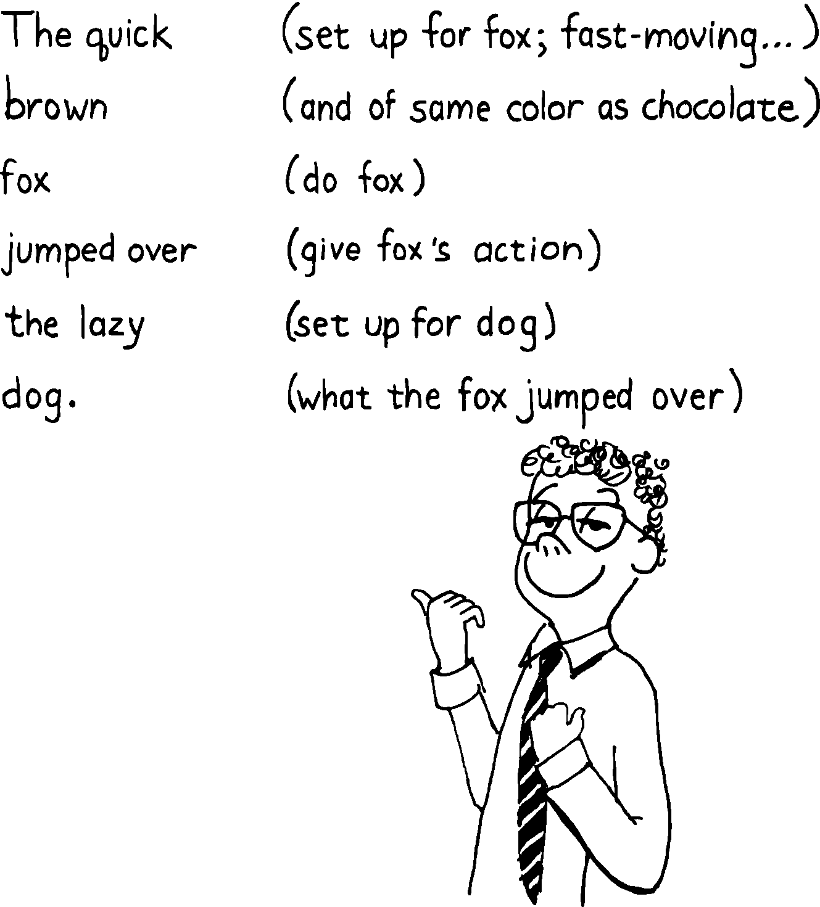

******************************************
5. Implementation: Elements of Forth Style
******************************************

Badly written Forth has been accused of looking
like “code that went through a trash compactor.” It’s true, Forth
affords more freedom in the way we write applications. But that freedom
also gives us a chance to write exquisitely readable and easily
maintainable code, provided we consciously employ the elements of good
Forth style.

In this chapter we’ll delve into Forth coding convention including:

-  listing organization

-  screen layout, spacing and indentation

-  commenting

-  choosing names

I wish I could recommend a list of hard-and-fast conventions for
everyone. Unfortunately, such a list may be inappropriate in many
situations. This chapter merges many widely-adopted conventions with
personal preferences, commented with alternate ideas and the reasons for
the preferences. In other words:

.. code-block:: none
   
   : TIP  VALUE JUDGEMENT ;

I’d especially like to thank Kim
Harris, who proposed many of the
conventions described in this chapter, for his continuing efforts at
unifying divergent views on good Forth style.

Listing Organization
====================

A well-organized book has clearly defined chapters, with clearly defined
sections, and a table of contents to help you see the organization at a
glance. A well-organized book is easy to read. A badly organized book
makes comprehension more difficult, and makes finding information later
on nearly impossible.

.. no  name for this figure. use fig5-1 Example of application-load screen

   I still don't see how these programming conventions enhance readability.

The necessity for good organization applies to an application listing as
well. Good organization has three aspects:

#. Decomposition

#. Composition

#. Disk partitioning

Decomposition
-------------

As we’ve already seen, the organization of a listing should follow the
decomposition of the application into lexicons. Generally these lexicons
should be sequenced in “uses” order. Lexicons being *used* should
precede the lexicons which *use* them.

On a larger scale, elements in a listing should be organized by degree
of complexity, with the most complex variations appearing towards the
end. It’s best to arrange things so that you can leave off the
lattermost screens (i.e., not load them) and still have a
self-sufficient, running application, working properly except for the
lack of the more advanced features.

We discussed the art of decomposition extensively in :doc:`Chapter Three<chapter3>`.

Composition
-----------

Composition is the putting together of pieces to create a whole. Good
composition requires as much artistry as good decomposition.

One of Forth’s present conventions is that source code resides in
“screens,” which are 1K units of mass storage. (The term “screen” refers
to a block used specifically for source code.) It’s possible in Forth to
chain every screen of code to the next, linking the entire listing
together linearly like a lengthy parchment scroll. This is not a useful
approach. Instead:

.. hint::

   Structure your application listing like a book: hierarchically.

An application may consist of:

Screens:
    the smallest unit of Forth source

Lexicons:
    one to three screens, enough to implement a component

Chapters:
    a series of related lexicons, and

Load screens:
    analogous to a table of contents, a screen that loads the chapters
    in the proper sequence.

Example of an application-load screen

.. code-block:: none
   :caption: Screen #1
   :name: fig5-1
   :lineno-start: 0

   \ QTF+ Load Screen                                      07/09/83
   : RELEASE#   ." 2.01" ;
     9 LOAD  \ compiler tools, language primitives
    12 LOAD  \ video primitives
    21 LOAD  \ editor
    39 LOAD  \ line display
    48 LOAD  \ formatter
    69 LOAD  \ boxes
    81 LOAD  \ deferring
    90 LOAD  \ framing
    96 LOAD  \ labels, figures, tables
   102 LOAD  \ table of contents generator

Application-load Screen
-----------------------

:numref:`fig5-1`  is an example of an application-load screen.
Since it resides in Screen 1, you can load this entire application by
entering

.. code-block:: none
   
   1 LOAD

The individual load commands within this screen load the chapters of the
application. For instance, Screen 12 is the load screen for the video
primitives chapter.

As a reference tool, the application-load screen tells you where to find
all of the chapters. For instance, if you want to look at the routines
that do framing, you can see that the section starts at Screen 90.

Each chapter-load screen in turn, loads all of the screens comprising
the chapter. We’ll study some formats for chapter-load screens shortly.

The primary benefit of this hierarchical scheme is that you can load any
section, or any screen by itself, without having to load the entire
application. Modularity of the source code is one of the reasons for
Forth’s quick turnaround time for editing, loading, and testing
(necessary for the iterative approach). Like pages of a book, each
screen can be accessed individually and quickly. It’s a “random access”
approach to source-code maintenance.

You can also replace any passage of code with a new, trial version by
simply changing the screen numbers in the load screen. You don’t have to
move large passages of source code around within a file.

In small applications, there may not be such things as chapters. The
application-load screen will directly load all the lexicons. In larger
applications, however, the extra level of hierarchy can improve
maintainability. A screen should either be a load-screen or a
code-screen, not a mixture. Avoid embedding a ``LOAD``
or ``THRU`` command in the middle of a screen
containing definitions just because you “need something” or because you
“ran out of room.”

Skip Commands
-------------

Two commands make it easy to
control what gets loaded in each screen and what gets ignored. They are:

.. code-block::

   \
   \S ( also called EXIT)

``\`` is pronounced “skip-line.” It causes the Forth
interpreter to ignore everything to the right of it on the same line.
(Since ``\`` is a Forth word, it must be followed by a
space.) It does not require a delimiter.

In :numref:`fig5-1` , you see ``\`` used in two ways:
to begin the screen-comment line (Line 0), and to begin comments on
individual lines which have no more code to the right of the comment.

During testing, ``\`` also serves to temporarily “paren out”
lines that already contain a right parenthesis in a name or comment. For
instance, these two “skip-line”s keep the definition of ``NUTATE`` from
being compiled without causing problems in encountering either right
parenthesis:

.. code-block:: none
   
   \ : NUTATE  ( x y z )
   \   SWAP ROT  (NUTATE) ;

``\S`` is pronounced “skip-screen.” It causes the
Forth interpreter to stop interpreting the screen entirely, as though
there were nothing else in the screen beyond ``\S``.

In many Forth systems, this function is the same as ``EXIT``, which is the
run-time routine for semicolon. In these systems the use of
``EXIT`` is acceptable. Some Forth systems, however,
require for internal reasons a different routine for the “skip-screen”
function.

Definitions for ``\`` and ``\S`` can be found in :doc:`Appendix C<appendixc>`.

Chapter-load Screens
--------------------

:numref:`fig5-2`  illustrates a typical chapter-load screen. The
screens loaded by this screen are referred to relatively, not absolutely
as they were in the application-load screen.

This is because the chapter-load screen is the first screen of the
contiguous range of screens in the chapter. You can move an entire
chapter forward or backward within the listing; the relative pointers in
the chapter-load screen are position-independent. All you have to change
is the single number in the application-load screen that points to the
beginning of the chapter.

Example of a chapter-load screen.

.. code-block:: none
   :name: fig5-2
   :caption: Screen #100
   :lineno-start: 0

   \ GRAPHICS                 Chapter load                 07/11/83
   
    1 FH LOAD            \ dot-drawing primitive
    2 FH 3 FH THRU       \ line-drawing primitives
    4 FH 7 FH THRU       \ scaling, rotation
    8 FH LOAD            \ box
    9 FH 11 FH THRU      \ circle
   
   CORNER  \ initialize relative position to low-left corner

.. hint::

   Use absolute screen numbers in the application-load screen.  Use
   relative screen numbers in the chapter- or section-load screens.

There are two ways to implement relative loading. The most common is to
define:

.. code-block:: none
   
   : +LOAD  ( offset -- )  BLK @ +  LOAD ;

and

.. code-block:: none
   
   : +THRU  ( lo-offset hi-offset -- )
        1+ SWAP DO  I +LOAD  LOOP ;

My own way, which I submit as a more useful factoring, requires a single
word, ``FH`` (see :doc:`Appendix C<appendixc>` for its definition).

The phrase

.. code-block:: none
   
   1 FH LOAD

is read “1 from here ``LOAD``,” and is equivalent to 1 ``+LOAD``.

Similarly,

.. code-block:: none
   
   2 FH   5 FH THRU

is read “2 from here, 5 from here ``THRU``.”

Some programmers begin each chapter with a dummy word; e.g.,

.. code-block:: none
   
   : VIDEO-IO ;

and list its name in the comment on the line where the chapter is loaded
in the application-load screen. This permits selectively ``FORGET`` ting any
chapter and reloading from that point on without having to look at the
chapter itself.

Within a chapter the first group of screens will usually define those
variables, constants, and other data structures needed globally within
the chapter. Following that will come the lexicons, loaded in “uses”
order. The final lines of the chapter-load screen normally invoke any
needed initialization commands.

Some of the more
style-conscious Forthwrights begin each chapter with a “preamble” that
discusses in general terms the theory of operation for the components
described in the chapter. :numref:`fig5-3`  is a sample preamble
screen which demonstrates the format required at Moore Products Co.

Moore Products Co.'s format for chapter preambles.

.. code-block:: none
   :name: fig5-3
   :caption: Screen #101
   :lineno-start: 0

   CHAPTER 5  -  ORIGIN/DESTINATION - MULTILOOP BIT ROUTINES
   
   DOCUMENTS - CONSOLE STRUCTURE CONFIGURATION
           DESIGN SPECIFICATION
           SECTIONS - 3.2.7.5.4.1.2.8
                      3.2.7.5.4.1.2.10
   
   ABSTRACT  -  File control types E M T Q and R can all
                originate from a Regional Satellite or a
                Data Survey Satellite.  These routines allow
                the operator to determine whether the control
                originated from a Regional Satellite or not.

.. code-block:: none
   :caption: Screen #102
   :lineno-start: 0

   CHAPTER NOTES - Whether or not a point originates from
                   a Regional Satellite is determined by
                   the Regional bit in BITS, as follows:
   
                     1 = Regional Satellite
                     2 = Data Survey Satellite
   
                    For the location of the Regional bit
                    in BITS, see the Design Specification
                    Section - 3.2.7.5.4.1.2.10
   
   HISTORY  -

**Charles Moore** (no relation to Moore Products Co.) places less importance on the well-organized hierarchical listing than I do. Moore:
    I structure **applications** hierarchically, but not necessarily
    **listings.**  My listings are organized in a fairly sloppy way,
    not at all hierarchically in the sense of primitives first.
    
    I use ``LOCATE`` [also known as ``VIEW``; see the Handy Hint
    in **Starting Forth**, Chapter Nine].  As a result, the
    listing is much less carefully organized because I have ``LOCATE``
    to find things for me.  I never look at listings.

––> vs. THRU
------------

On the subject of relative loading,
one popular way to load a series of adjacent screens is with the word
``-->`` (pronounced “next block”). This word causes the interpreter to
immediately cease interpreting the current screen and begin interpreting
the next (higher-numbered) screen.

If your system provides ``-->``, you must choose between using the
``THRU`` command in your chapter-load screen to load
each series of screens, or linking each series together with the arrows
and LOADing only the first in the series. (You can’t do both; you’d end
up loading most of the screens more than
once.)

The nice thing about the arrows is this: suppose you change a screen in
the middle of a series, then reload the screen. The rest of the series
will automatically get loaded. You don’t have to know what the last
screen is.

That’s also the nasty thing about the arrows: There’s no way to stop the
loading process once it starts. You may compile a lot more screens than
you need to test this one screen.

To get analytical about it, there are three things you might want to do
after making the change just described:

1. load the one screen only, to test the change,

2. load the entire section in which the screen appears,

or

3. load the entire remainder of the application.

The use of ``THRU`` seems to give you the greatest
control.

Some people consider the arrow to be useful for letting definitions
cross screen boundaries. In fact ``-->`` is the only way to compile a
high-level (colon) definition that occupies more than one screen,
because ``-->`` is “immediate.” But it’s *never* good style to let a colon
definition cross screen boundaries. (They should never be that long!)

On the other hand, an extremely complicated and time-critical piece of
assembler coding might occupy several sequential screens. In this case,
though, normal ``LOAD`` ing will do just as well, since
the assembler does not use compilation mode, and therefore does not
require immediacy.

Finally, the arrow wastes an extra line of each source screen. We don’t
recommend it.

An Alternative to Screens: Source in Named Files
------------------------------------------------

Some Forth practitioners
advocate storing source code in variable-length, named text files,
deliberately emulating the approach used by traditional compilers and
editors. This approach may become more and more common, but its
usefulness is still controversial.

Sure, it’s nice not to have to worry about running out of room in a
screen, but the hassle of writing in a restricted area is compensated
for by retaining control of discrete chunks of code. In developing an
application, you spend a lot more time loading and reloading screens
than you do rearranging their contents.

“Infinite-length” files allow sloppy, disorganized thinking and bad
factoring. Definitions become longer without the discipline imposed by
the 1K block boundaries. The tendency becomes to write a 20K file, or
worse: a 20K definition.

Perhaps a nice compromise would be a file-based system that allows
nested loading, and encourages the use of very small named files. Most
likely, though, the more experienced Forth programmers would not use
named files longer than 5K to 10K. So what’s the
benefit?

Some might answer that rhetorical question: “It’s easier to remember
names than numbers.” If that’s so, then predefine those block numbers as
constants, e.g.:

.. code-block:: none
   
   90 CONSTANT FRAMING

Then to load the “framing” section, enter

.. code-block:: none
   
   FRAMING LOAD

Or, to list the section’s load block, enter

.. code-block:: none
   
   FRAMING LIST

(It’s a convention that names of sections end in “ING.”)

Of course, to minimize the hassle of the screen-based approach you need
good tools, including editor commands that move lines of source from one
screen to another, and words that slide a series of screens forward or
back within the listing.

Disk Partitioning
-----------------

The final aspect of the
well-organized listing involves standardizing an arrangement for what
goes where on the disk. These standards must be set by each shop, or
department, or individual programmer, depending on the nature of the
work.

.. list-table:: Example of a disk-partitioning scheme within one department.
   :name: fig5-4
   :widths: auto

   * - Screen 0
     - is the title screen, showing the name of the
       application, the current release number, and primary author.
   * - Screen 1
     - is the application-load block.
   * - Screen 2
     - is reserved for possible continuation from Screen 1
   * - Screen 4 and 5
     - contain system messages.
   * - Screens 9 thru 29
     - incorporate general utilities needed
       in, but not restricted to, this application.
   * - Screen 30
     - begins the application screens.

:numref:`fig5-4`  shows a typical department’s partitioning scheme.

In many Forth shops it’s considered desirable to begin sections of code
on screen numbers that are evenly divisible by three. Major divisions on
a disk should be made on boundaries evenly divisible by
thirty.

The reason? By convention, Forth screens are printed three to a page,
with the top screen always evenly divisible by three. Such a page is
called a “triad;” most Forth systems include the word ``TRIAD`` to produce
it, given as an argument the number of any of the three screens in the
triad. For instance, if you type

.. code-block:: none
   
   77 TRIAD

you’ll get a page that includes 75, 76, and 77.

The main benefit of this convention is that if you change a single
screen, you can slip the new triad right into your binder containing the
current listing, replacing exactly one page with no overlapping screens.

Similarly, the word ``INDEX`` lists the first line of each screen, 60 per
page, on boundaries evenly divisible by 60.

.. hint::

   Begin sections or lexicons on screen numbers evenly divisible by three.
   Begin applications or chapters on screen numbers evenly divisible by
   thirty.

Electives
---------

Vendors of Forth systems have a
problem. If they want to include every command that the customer might
expect—words to control graphics, printers, and other niceties—they
often find that the system has swollen to more than half the memory
capacity of the computer, leaving less room for serious programmers to
compile their applications. The solution is for the vendor to provide
the bare bones as a precompiled nucleus, with the extra goodies provided
in *source* form. This approach allows the programmer to pick and choose
the special routines actually needed.

These user-loadable routines are called “electives.” Double-length
arithmetic, date and time support, ``CASE`` statements and the
``DOER/MAKE`` construct (described later) are some of the
features that Forth systems should offer as electives.

Screen Layout
=============

In this section we’ll discuss the layout of each source screen.

.. hint::

   Reserve Line 0 as a "comment line."

The comment line serves both as a heading for the screen, and also as a
line in the disk ``INDEX``. It should describe the purpose of the screen
(not list the words defined therein).

The comment line minimally contains the name of the screen. In larger
applications, you may also include both the chapter name and screen
name. If the screen is one of a series of screens implementing a
lexicon, you should include a “page number” as well.

The upper right hand corner is reserved for the “stamp.” The stamp
includes the date of latest revision and, when authorship is important,
the programmer’s initials (three characters to the left of the date);
e.g.:

.. code-block:: none
   
   ( Chapter name        Screen Name -- pg #      JPJ 06/10/83)

Some Forth editors will enter the stamp for you at the press of a key.

A common form for representing dates is

.. code-block:: none
   
   mm-dd-yy

that is, February 6, 1984 would be expressed

.. code-block:: none
   
   02-06-84

An increasingly popular alternative uses

.. code-block:: none
   
   ddMmmyy

where “Mmm” is a three-letter abbreviation of the month. For instance:

.. code-block:: none
   
   22Oct84

This form requires fewer characters than

.. code-block:: none
   
   10-22-84

and eliminates possible confusion between dates and months.

If your system has ``\`` (“skip-line”—see :doc:`Appendix C<appendixc>`),
you can write the comment line like this:

.. code-block:: none
   
   \ Chapter name        Screen Name -- pg.#       JPJ 06/10/83

As with all comments, use lower-case or a mixture of lower- and
upper-case text in the comment line.

One way to make the index of an application reveal more about the
organization of the screens is to indent the comment line by three
spaces in screens that continue a lexicon.  :numref:`fig5-5` 
shows a portion of a list produced by ``INDEX`` in
which the comment lines for the continuing screens are
indented.

.. code-block:: none
   :name: fig5-5
   :caption: The output of ``INDEX`` showing indented comment lines.
   :lineno-start: 0
   
    90 \ Graphics           Chapter load               JPJ 06/10/83
    91    \ Dot-drawing primitives                     JPJ 06/10/83
    92 \ Line-drawing primitives                       JPJ 06/11/83
    93    \ Line-drawing primitives                    JPJ 06/10/83
    94    \ Line-drawing primitives                    JPJ 09/02/83
    95 \ Scaling, rotation                             JPJ 06/10/83
    96    \ Scaling, rotation                          JPJ 02/19/84
    97    \ Scaling, rotation                          JPJ 02/19/84
    98    \ Scaling, rotation                          JPJ 02/19/84
    99 \ Boxes                                         JPJ 06/10/83
   100 \ Circles                                       JPJ 06/10/83
   101    \ Circles                                    JPJ 06/10/83
   102    \ Circles                                    JPJ 06/10/83

.. hint::

   Begin all definitions at the left edge of the screen, and define only
   one word per line.

*Bad:*

.. code-block:: none
   
   : ARRIVING   ." HELLO" ;   : DEPARTING   ." GOODBYE" ;

*Good:*

.. code-block:: none
   
   : ARRIVING   ." HELLO" ;
   : DEPARTING   ." GOODBYE" ;

This rule makes it easier to find a definition in the listing. (When
definitions continue for more than one line, the subsequent lines should
always be indented.) ``VARIABLE`` s and
``CONSTANT`` s should also be defined one per line.
(See “Samples of Good Commenting Style” in :doc:`Appendix E<appendixe>`) This
leaves room for an explanatory comment on the same line. The exception
is a large “family” of words (defined by a common defining-word) which
do not need unique comments:

.. code-block:: none
   
   0 HUE BLACK     1 HUE BLUE      2 HUE GREEN
   3 HUE CYAN      4 HUE RED       5 HUE MAGENTA

.. hint::

   Leave lots of room at the bottom of the screen for later additions.

On your first pass, fill each screen no more than half with code. The
iterative approach demands that you sketch out the components of your
application first, then iteratively flesh them out until all the
requirements are satisfied. Usually this means adding new commands, or
adding special-case handling, to existing screens. (Not *always,*
though. A new iteration may see a simplification of the code. Or a new
complexity may really belong in another component and should be factored
out, into another screen.)

Leaving plenty of room at the outset makes later additions more
pleasant. One writer recommends that on the initial pass, the screen
should contain about 20–40 percent code and 80–60 percent whitespace
[stevenson81]_ .

Don’t skip a line between each definition. You may, however, skip a line
between *groups* of definitions.

.. hint::

   All screens must leave ``BASE`` set to ``DECIMAL``.

Even if you have three screens in a row in which the code is written in
``HEX`` (three screens of assembler code, for
instance), each screen must set ``BASE`` to ``HEX`` at the
top, and restore base to ``DECIMAL`` at the bottom.
This rule ensures that each screen could be loaded separately, for
purposes of testing, without mucking up the state of affairs. Also, in
reading the listing you know that values are in decimal unless the
screen explicitly says ``HEX``.

Some shops take this rule even further. Rather than brashly resetting
base to ``DECIMAL`` at the end, they reset base to
*whatever it was at the beginning.* This extra bit of insurance can be
accomplished in this fashion:

.. code-block:: none
   
   BASE @       HEX    \ save original BASE on stack
   0A2 CONSTANT BELLS
   0A4 CONSTANT WHISTLES
   ... etc. ...
   BASE !              \ restore it

Sometimes an argument is passed on the stack from
screen to screen, such as the value returned by
``BEGIN`` or ``IF`` in a multiscreen assembler definition, or the base address
passed from one defining word to another—see “Compile-Time Factoring” in
:doc:`Chapter Six<chapter6>`. In these cases, it’s best to save the value of
``BASE`` on the return stack like this:

.. code-block:: none
   
   BASE @ >R     HEX
   ... etc. ...
   R> BASE !

Some folks make it a policy to use this approach on any screen that
changes ``BASE``, so they don’t have to worry about it.

Moore prefers to define ``LOAD`` to invoke ``DECIMAL`` after
loading. This approach simplifies the screen’s contents because you
don’t have to worry about resetting.

Spacing and Indentation
-----------------------

.. hint::

   Spacing and indentation are essential for readability.

The examples in this book use widely accepted conventions of spacing and
indenting style. Whitespace, appropriately used, lends readability.
There’s no penalty for leaving space in source screens except disk
memory, which is cheap.

For those who like their conventions in black and white, Table
:numref:`tab-5-1` is a list of guidelines. (But remember,
Forth’s interpreter couldn’t care less about spacing or indentation.)

.. list-table:: Indentation and spacing guidelines
   :name: tab-5-1

   * - 1 space between the colon and the name
   * - 2 spaces between the name and the comment [#f1]_ 
   * - 2 spaces, or a carriage return, after the comment and
   * - before the definition [#f1]_
   * - 3 spaces between the name and definition if no comment is used
   * - 3 spaces indentation on each subsequent line
       (or multiples of 3 for nested indentation)
   * - 1 space between words/numbers within a phrase
   * - 2 or 3 spaces between phrases
   * - 1 space between the last word and the semicolon
   * - 1 space between semicolon and ``IMMEDIATE`` (if invoked)

No blank lines between definitions, except to separate distinct groups
of definitions
	   
The last position of each line should be blank except for:

#. quoted strings that continue onto the next line, or

#. the end of a comment.

A comment that begins with ``\`` may continue right to the
end of the line. Also, a comment that begins with ( may have its
delimiting right parenthesis in the last column.

Here are some common errors of spacing and indentation:

*Bad* (name not separated from the body of the definition):

.. code-block:: none
   
   : PUSH HEAVE HO ;

*Good:*

.. code-block:: none
   
   : PUSH   HEAVE HO ;

*Bad* (subsequent lines not indented three spaces):

.. code-block:: none
   
   : RIDDANCE  ( thing-never-to-darken-again -- )
   DARKEN  NEVER AGAIN ;

*Good:*

.. code-block:: none
   
   : RIDDANCE  ( thing-never-to-darken-again -- )
      DARKEN  NEVER AGAIN ;

*Bad* (lack of phrasing):

.. code-block:: none
   
   : GETTYSBURG   4 SCORE 7 YEARS + AGO ;

*Good:*

.. code-block:: none
   
   : GETTYSBURG   4 SCORE   7 YEARS +   AGO ;

Phrasing is a subjective art; I’ve yet to see a useful set of formal
rules. Simply strive for readability.

.. [#f1]
   An often-seen alternative calls for 1 space between the name and
   comment and 3 between the comment and the definition. A more liberal
   technique uses 3 spaces before and after the comment. Whatever you
   choose, be consistent.

Comment Conventions
===================

Appropriate commenting is essential. There are five types of comments:
stack-effect comments, data-structure comments, input-stream comments,
purpose comments and narrative comments.

*A* stack-effect comment
    shows the arguments that
    the definition consumes from the stack, and the arguments it returns
    to the stack, if any.

*A* data-structure comment
    indicates the position
    and meaning of elements in a data structure. For instance, a text
    buffer might contain a count in the first byte, and 63 free bytes
    for text.

*An* input-stream comment
    indicates what strings
    the word expects to see in the input stream. For example, the Forth
    word FORGET scans for the name of a dictionary entry in the input
    stream.

*A* purpose comment
    describes, in as few words
    possible, what the definition does. How the definition works is not
    the concern of the purpose comment.

*A* narrative comment
    appears amidst a definition
    to explain what is going on, usually line-by-line. Narrative
    comments are used only in the “vertical format,” which we’ll
    describe in a later section.

Comments are usually typed in lower-case letters to distinguish them
from source code. (Most Forth words are spelled with upper-case letters,
but lower-case spellings are sometimes used in special cases.)

In the following sections we’ll summarize the standardized formats for
these types of comments and give examples for each type.

Stack Notation
--------------

.. hint::

   Every colon or code definition that consumes and/or returns any arguments
   on the stack must include a stack-effect comment.

“Stack notation” refers to conventions for representing what’s on the
stack. Forms of stack notation include “stack pictures,” “stack
effects,” and “stack-effect
comments.”

Stack Picture
-------------

A stack picture depicts items understood to be on the stack at a given
time. Items are listed from left to right, with the leftmost item
representing the bottom of the stack and the rightmost item representing
the top.

For instance, the stack picture

.. code-block:: none
   
   nl n2

indicates two numbers on the stack, with n2 on the top (the most
accessible position).

This is the same order that you would use to type these values in; i.e.,
if n1 is 100 and n2 is 5000, then you would type

.. code-block:: none
   
   100 5000

to place these values correctly on the stack.

A stack picture can include either abbreviations, such as “n1,” or fully
spelled-out words. Usually abbreviations are used. Some standard
abbreviations appear in Table :numref:`tab-5-2`. Whether
abbreviations or fully spelled-out words are used, each stack item
should be separated by a space.

If a stack item is described with a phrase (such as
“address-of-latest-link”), the words in the phrase should be joined by
hyphens. For example, the stack picture:

.. code-block:: none
   
   address current-count max-count

shows three elements on the stack.

Stack Effect
------------

A “stack effect” shows two stack pictures: one picture of any items that
may be *consumed* by a definition, and another picture of any items
*returned* by the definition. The “before” picture comes first, followed
by two hyphens, then the “after” picture.

For instance, the stack effect for Forth’s addition operator, ``+`` is

.. code-block:: none
   
   n n -- sum

where ``+`` consumes two numbers and returns their sum.

Remember that the stack effect describes only the *net result* of the
operation on the stack. Other values that happen to reside on the stack
beneath the arguments of interest don’t need to be shown. Nor do values
that may appear or disappear while the operation is executing.

If the word returns any input arguments unchanged, they should be
repeated in the output picture; e.g.,

.. code-block:: none
   
   3rd 2nd top-input -- 3rd 2nd top-output

Conversely, if the word changes any arguments, the stack comment must
use a different descriptor:

.. code-block:: none
   
   nl -- n2
   n -- n'

A stack effect might appear in a formatted glossary.

Stack Effect Comment
--------------------

A “stack-effect comment” is a stack effect that appears in source code
surrounded by parentheses. Here’s the stack-effect comment for the word
COUNT:

.. code-block:: none
   
   ( address-of-counted-string -- address-of-text count)

or:

.. code-block:: none
   
   ( 'counted-string -- 'text count)

(The “count” is on top of the stack after the word has executed.)

If a definition has no effect on the stack (that is, no effect the user
is aware of, despite what gyrations occur within the definition), it
needs no stack-effect comment:

.. code-block:: none
   
   : BAKE   COOKIES OVEN ! ;

On the other hand, you may want to use an empty stack comment—i.e.,

.. code-block:: none
   
   : BAKE   ( -- )  COOKIES OVEN ! ;

to emphasize that the word has no effect on the stack.

If a definition consumes arguments but returns none, the double-hyphen
is optional. For instance,

.. code-block:: none
   
   ( address count -- )

can be shortened to

.. code-block:: none
   
   ( address count)

The assumption behind this convention is this: There are many more colon
definitions that consume arguments and return nothing than definitions
that consume nothing and return arguments.

Stack Abbreviation Standards
----------------------------

Abbreviations used in stack notation should be consistent. Table
:numref:`tab-5-2` lists most of the commonly used
abbreviations. (This table reappears in :doc:`Appendix E<appendixe>`.) The terms
“single-length,” “double-length,” etc. refer to the size of a “cell” in
the particular Forth system. (If the system uses a 16-bit cell, “n”
represents a 16-bit number; if the system uses a 32-bit cell, “n”
represents a 32-bit number.)

Notation of Flags
-----------------

Table :numref:`tab-5-2` shows three ways to represent a boolean
flag. To illustrate, here are three versions of the same stack comment
for the word ``-TEXT``:

.. code-block:: none
   
   ( at u a2 -- ?)
   ( at u a2 -- t=no-match)
   ( at u a2 -- f=match)

.. list-table:: Stack-comment abbreviations.
   :name: tab-5-2
   :widths: auto

   * - n
     - single-length signed number
   * - d
     - double-length signed number
   * - u
     - single-length unsigned number
   * - ud
     - double-length unsigned number
   * - t
     - triple-length
   * - q
     - quadruple-length
   * - c
     - 7-bit character value
   * - b
     - 8-bit byte
   * - ?
     - boolean flag; or;
   * - 　t=
     - true
   * - 　f=
     - false
   * - a or adr
     - address
   * - acf
     - address of code field
   * - apf
     - address of parameter field
   * - \'
     - (as prefix) address of
   * - s d
     - (as a pair) source destination
   * - lo hi
     - lower-limit upper-limit (inclusive)
   * - #
     - count
   * - o
     - offset
   * - i
     - index
   * - m
     - mask
   * - x
     - don\'t care (data structure notation)

| An “offset” is a difference expressed in absolute units, such as bytes.
| An “index” is a difference expressed in logical units, such as elements or records. 

The equal sign after the symbols “t” and “f” equates the flag outcome
with its meaning. The result-side of the second version would be read
“true means no match.”

Notation of Variable Possibilities
----------------------------------

Some definitions yield a different stack effect under different circumstances.

If the number of items on the stack remains the same under all conditions, but
the items themselves change, you can use the vertical bar ( ``|`` ) to mean
“or.” The following stack-effect comment describes a word that returns either
the address of a file or, if the requested file is not found, zero:

.. code-block:: none
   
   ( -- address|O=undefined-file)

If the number of items in a stack picture can vary—in either the
“before” or “after” picture—you must write out both versions of the
entire stack picture, along with the double-hyphen, separated by the
“or” symbol. For instance:

.. code-block:: none
   
   -FIND   ( -- apf len t=found | -- f=not-found )

This comment indicates that if the word is found, three arguments are
returned (with the flag on top); otherwise only a false flag is
returned.

Note the importance of the second “--”. Its omission would indicate that
the definition always returned three arguments, the top one being a
flag.

If you prefer, you can
write the entire stack effect twice, either on the same line, separated
by three spaces:

.. code-block:: none
   
   ?DUP   \ if zero: ( n -- n)    if non-zero:( n -- n n)

or listed vertically:

.. code-block:: none
   
   -FIND  \     found:( -- apf len t )
          \ not-found:( -- f )

Data-Structure Comments
-----------------------

A “data-structure comment” depicts the elements in a data structure. For
example, here’s the definition of an insert buffer called \|INSERT :

.. code-block:: none
   
   CREATE |INSERT  64 ALLOT  \  { 1# | 63text }

The “faces” (curly-brackets) begin and end the structure comment; the
bars separate the various elements in the structure; the numbers
represent bytes per element. In the comment above, the first byte
contains the count, and the remaining 63 bytes contain the text.

A “bit comment” uses the same format as a data-structure comment to
depict the meaning of bits in a byte or cell. For instance, the bit
comment

.. code-block:: none
   
   { 1busy? | 1acknowledge? | 2x | 6input-device |
      6output-device }

describes the format of a 16-bit status register of a communications
channel. The first two bits are flags, the
second two bits are unused, and the final pair of six-bit fields
indicate the input and output devices which this channel is connected
to.

If more than one data structure employs the same pattern of elements,
write out the comment only once (possibly in the preamble), and give a
name to the pattern for reference in subsequent screens. For instance,
if the preamble gives the above bit-pattern the name “status,” then
“status” can be used in stack comments to indicate values with that
pattern:

.. code-block:: none
   
   : STATUS?  ( -- status) ... ;

If a ``2VARIABLE`` contains one double-length value,
the comment should be a stack picture that indicates the contents:

.. code-block:: none
   
   2VARIABLE PRICE  \ price in cents

If a ``2VARIABLE`` contains two single-length data
elements, it’s given a stack picture showing what would be on the stack
after a ``2@``. Thus:

.. code-block:: none
   
   2VARIABLE MEASUREMENTS  ( height weight )

This is different from the comment that would be used if ``MEASUREMENTS``
were defined by ``CREATE``.

.. code-block:: none
   
   CREATE MEASUREMENTS  4 ALLOT    \ { 2weight | 2height }

(While both statements produce the same result in the dictionary, the
use of ``2VARIABLE`` implies that the values will
normally be “2-fetched” and “2-stored” together-thus we use a *stack*
comment. The high-order part, appearing on top of the stack, is listed
to the right. The use of ``CREATE`` implies that the
values will normally be fetched and stored separately–thus we use a data
structure comment. The item in the 0th position is listed to the
left.)

Input-stream Comments
---------------------

The input-stream comment indicates what words and/or strings are
presumed to be in the input stream. Table :numref:`tab-5-3`
lists the designations used for input stream arguments.

.. table:: Input-stream comment designations.
   :name: tab-5-3 
   :widths: auto

   ==== ==============================================
   c    single character, blank-delimited
   name sequence of characters, blank delimited
   text sequence of characters, delimited by non-blank
   ==== ==============================================

Follow "text" with the actual delimiter required; e.g.: "text" or text

The input-stream comment appears *before* the stack comment, and is
*not* encapsulated between its own pair of parentheses, but simply
surrounded by three spaces on each side. For instance, here’s one way to
comment the definition of ``’`` (tick) showing first the input-stream
comment, then the stack comment:

.. code-block:: none
   
   : '   \ name   ( -- a)

If you prefer to use ``(`` , the comment would look like this:

.. code-block:: none
   
   : '   ( name   ( -- a)

Incidentally, there are
three distinct ways to receive string input. To avoid confusion, here
are the terms:

Scanning-for
    means looking ahead in the input
    stream, either for a word or number as in the case of tick, or for a
    delimiter as in the case of ``."`` and ``(`` .

Expecting
    means waiting for. ``EXPECT`` and ``KEY``,
    and definitions that invoke them, are ones that “expect” input.

Presuming
    indicates that in normal usage
    something will follow. The word: “scans-for” the name to be defined,
    and “presumes” that a definition will follow.

The input-stream comment is only appropriate for input being
scanned-for.

Purpose Comments
----------------

.. hint::

   Every definition should bear a purpose comment unless:
   
   #. its purpose is clear from its name or its stack-effect comment, or
   #. if it consists of three or fewer words.

The purpose comment should be kept to a minimum-never more than a full
line. For example:

.. code-block:: none
   
   : COLD   \ restore system to start condition
       ... ;

Use the imperative mood: “set Foreground color,” not “sets Foreground
color.”

On the other hand, a word’s purpose can often be described in terms of
its stack-effect comment. You rarely need both a stack comment and a
purpose comment. For instance:

.. code-block:: none
   
   : SPACES  ( #)   ... ;

or

.. code-block:: none
   
   : SPACES  ( #spaces-to-type -- )   ... ;

This definition takes as its incoming argument a number that represents
the number of spaces to type.

.. code-block:: none
   
   : ELEMENT  ( element# -- 'element)  2*  TABLE + ;

..

This definition converts an index, which it consumes, into an address
within a table of 2-byte elements corresponding to the indexed element.

.. code-block:: none
   
   : PAD  ( -- 'scratch-pad)  HERE  80 + ;

This definition returns an address of a scratch region of memory.

Occasionally, readability is best served by including both types of
comment. In this case, the purpose comment should appear last. For
instance:

.. code-block:: none
   
   : BLOCK  ( n -- a)  \   ensure block n in buffer at a

.. hint::

   Indicate the type of comment by ordering: input-stream comments first,
   stack-effect comments second, purpose comments last.

For example:

.. code-block:: none
   
   : GET   \   name   ( -- a)   get first match

If you prefer to use ``(``, then write:

.. code-block:: none
   
   : GET   (   name  ( -- a)    ( get first match)

If necessary, you can put the purpose comment on a second line:

.. code-block:: none
   
   : WORD   \   name   ( c -- a)
      \ scan for string delimt'd by "c"; leave at a
      ...  ;

Comments for Defining Words
---------------------------

The definition of
a defining word involves two behaviors:

-  that of the defining word as it defines its “child” (compile-time
   behavior), and

-  that of the child itself (run-time behavior).

These two behaviors must be commented separately.

.. hint::

   Comment a defining word's compile-time behavior in the usual way;
   comment its run-time behavior separately, following the word
   ``DOES>`` (or ``;CODE``).

For instance,

.. code-block:: none
   
   : CONSTANT  ( n ) CREATE ,
      DOES>  ( -- n)  @ ;

The stack-effect comment for the run-time (child’s) behavior represents
the net stack effect for the child word. Therefore it does not include
the address returned by ``DOES>,`` even though this
address is on the stack when the run-time code begins.

*Bad* (run-time comment includes apf):

.. code-block:: none
   
   : ARRAY   \  name  ( #cells)
      CREATE 2* ALLOT
      DOES>   ( i apf -- 'cell)  SWAP  2* + ;

*Good:*

.. code-block:: none
   
   : ARRAY   \  name  ( #cells)
      CREATE 2* ALLOT
       DOES>  ( i -- 'cell)  SWAP  2* + ;

Words defined by this word ARRAY will exhibit the stack effect:

.. code-block:: none
   
   ( i -- 'cell)

If the defining word does not specify the run-time behavior, there still
exists a run-time behavior, and it may be commented:

.. code-block:: none
   
   : VARIABLE   (  name  ( -- )  CREATE  2 ALLOT ;
      \ does>   ( -- adr )

Comments for Compiling Words
----------------------------

As with defining words, most compiling words involve two behaviors:

#. That of the compiling word as the definition in which it appears is
   compiled

#. That of the run-time routine which will execute when we invoke the
   word being defined. Again we must comment each behavior separately.

.. hint::

   Comment a compiling word's run-time behavior in the usual way; comment
   its compile-time behavior separately, beginning with the label
   "Compile:".

For instance:

.. code-block:: none
   
   : IF   ( ? -- ) ...
   \ Compile:   ( -- address-of-unresolved-branch)
      ... ; IMMEDIATE

In the case of compiling words, the first comment describes the run-time
behavior, which is usually the *syntax for using* the word. The second
comment describes what the word *actually does* in compiling (which is
of less importance to the user).

Other examples:

.. code-block:: none
   
   : ABORT"  ( ? -- )
   \ Compile:   text"   ( -- )

Occasionally a compiling word may exhibit a different behavior when it
is invoked *outside* a colon definition. Such words (to be fastidious
about it) require three comments. For instance:

.. code-block:: none
   
   : ASCII  ( -- c)
   \ Compile:   c   ( -- )
   \ Interpret:   c   ( -- c )
        ... ; IMMEDIATE

:doc:`Appendix E<appendixe>` includes two screens showing good commenting style.

Vertical Format vs. Horizontal Format
=====================================

The purpose of commenting is to allow a reader of your code to easily
determine what’s going on. But how much commenting is necessary? To
determine the level of commenting appropriate for your circumstances,
you must ask yourself two questions:

-  Who will be reading my code? 

-  How readable are my definitions?

There are two basic styles
of commenting to choose from. The first style, often called the
“vertical format,” includes a step-by-step description of the process,
in the manner of a well-commented assembly language listing. These
line-by-line comments are called “narrative comments.”

.. code-block:: none
   :lineno-start: 0
   
   \ CRC Checksum                                      07/15/83
   : ACCUMULATE   ( oldcrc char -- newcrc)
      256 *               \ shift char to hi-order byte
      XOR                 \ & xor into previous crc
      8 0 DO              \ Then for eight repetitions,
          DUP 0< IF       \ if hi-order bit is "1"
             16386 XOR    \ xor it with mask and
             DUP +        \ shift it left one place
             1+           \ set lo-order bit to "1"
                 ELSE     \ otherwise, i.e. hi-order bit is "0"
             DUP +        \ shift it left one place
                 THEN
          LOOP ;          \ complete the loop

The other approach does not intersperse narrative comments between code
phrases. This is called the “horizontal format.”

.. code-block:: none
   
   : ACCUMULATE  ( oldcrc char -- newcrc)
      256 *  XOR  8 0 DO  DUP 0< IF
         16386 XOR  DUP +  1+  ELSE  DUP +  THEN  LOOP ;

The vertical format is preferred when a large team of programmers are
coding and maintaining the application. Typically, such a team will
include several junior-level programmers responsible for minor
corrections. In such an environment, diligent commenting can save a lot
of time and upset. As Johnson of
Moore Products Co. says: “When maintaining code you are usually
interested in just one small section, and the more information written
there the better your chances for a speedy fix.”

Here are several pertinent rules required of the Forth programmers at
Moore Products Co. (I’m paraphrasing):

#. A vertical format will be used. Comments will appear to the right of
   the source code, but may continue to engulf the next line totally if
   needed.

#. There should be more comment characters than source characters. (The
   company encourages long descriptive names, greater than ten
   characters, and allows the names to be counted as comment
   characters.)

#. Any conditional structure or application word should appear on a
   separate line. “Noise words” can be grouped together. Indentation is
   used to show nested conditionals.

There are some difficulties with this format,
however. For one thing,
line-by-line commenting is time-consuming, even with a good screen
editor. Productivity can be stifled, especially when stopping to write
the comments breaks your chain of thought.

Also, you must also carefully ensure that the comments are up-to-date.
Very often code is corrected, the revision is tested, the change
works—and the programmer forgets to change the comments. The more
comments there are, the more likely they are to be wrong. If they’re
wrong, they’re worse than useless.

This problem can be alleviated if the project supervisor carefully
reviews code and ensures the accuracy of comments.

Finally, line-by-line commenting can allow a false sense of security.
Don’t assume that because each *line* has a comment, the *application*
is well-com-men-ted. Line-by-line commenting
doesn’t address the significant aspects of a definition’s operation.
What, for instance, is the thinking behind the checksum algorithm used?
Who knows, from the narrative
comments?

To properly describe, in prose, the implications of a given procedure
usually requires many paragraphs, not a single phrase. Such descriptions
properly belong in auxiliary documentation or in the chapter preamble.

Despite these cautions, many companies find the vertical format
necessary. Certainly a team that is newly exposed to Forth should adopt
it, as should any very large team.

What about the horizontal format? Perhaps it’s an issue of art vs.
practicality, but I feel compelled to defend the horizontal format as
equally valid and in some ways superior.

If Forth code is really well-written, there should be nothing ambiguous
about it. This means that:

-  supporting lexicons have a well-designed syntax

-  stack inputs and outputs are commented

-  the purpose is commented (if it’s not clear from the name or stack
   comment)

-  definitions are not too long

-  not too many arguments are passed to a single definition via the
   stack (see “The Stylish Stack” in :doc:`Chapter Seven<chapter7>`).

Forth is simply not like other languages, in which line-by-line
commenting is one of the few things you can do to make programs more
readable.

Skillfully written Forth code is like poetry, containing precise meaning
that both programmer and machine can easily read. Your *goal* should be
to write code that does not need commenting, even if you choose to
comment it. Design your application so that the code, not the comments,
conveys the meaning.

If you succeed, then you can eliminate the clutter of excessive
commenting, achieving a purity of expression without redundant
explanations.

.. fig5-2 used for Example of a chapter-load screen.

   Wiggins, proud of his commenting technique.

.. hint::

   The most-accurate, least-expensive documentation
   is self-documenting code.

Unfortunately, even the best programmers, given the pressure of a
deadline, may write working code that is not easily readable without
comments. If you are writing for yourself, or for a small group with
whom you can verbally communicate, the horizontal format is ideal.
Otherwise, consider the vertical
format.

Choosing Names: The Art
=======================

    Besides a mathematical inclination, an exceptionally good mastery of
    one\'s native tongue is the most vital asset of a competent programmer
    (**Prof.  Edsger W. Dijkstra** [dijkstra82]_ ).

We’ve talked about the
significance of using names to symbolize ideas and objects in the
application. The choosing of names turns out to be an important part of
the design process.

Newcomers tend to overlook the important of names. “After all,” they
think, “the computer doesn’t care what names I choose.”

But good names are essential for readability. Moreover, the mental
exercise of summoning a one-word description bears a synergistic effect
on your perceptions of what the entity should or should not do.

Here are some rules for choosing good names:

.. hint::

   Choose names according to "what," not "how."

A definition should hide the complexities of implementation from other
definitions which invoke it. The name, too, should hide the details of
the procedure, and instead should describe the outward appearance or net
effect.

For instance, the Forth word ``ALLOT`` simply
increments the dictionary pointer (called ``DP`` or
``H`` in most systems). But the name
``ALLOT`` is better than ``DP+!`` because the user is
thinking of reserving space, not incrementing a pointer.

The ’83 Standard adopted the name ``CMOVE>`` instead
of the previous name for the same function,
``<CMOVE``. The operation makes it possible to copy a
region of memory *forward* into overlapping memory. It accomplishes this
by starting with the last byte and working *backward*. In the new name,
the forwardness of the “what” supersedes the backwardness of the “how.”

.. hint::

   Find the most expressive word.

..

    A powerful agent is the right word.  Whenever we come upon one of
    those intensely right words in a book or a newspaper the resulting
    effect is physical as well as spiritual, and electrically prompt
    **(Mark Twain)** .
    
    The difference between the right word and the almost-right word is
    like the difference between lightning and the lightning bug
    **(Mark Twain)** .
    
    Suit the action to the word, the word to the action
    **(Shakespeare, Hamlet, Act~III)** .

Henry Laxen, a Forth consultant and
author, suggests that the most important Forth development tool is a
good thesaurus [laxen]_ .

Sometimes you’ll think of an adequate word for a definition, but it
doesn’t feel quite right. It may be months later before you realize that
you fell short of the mark. In the Roman numeral example in :doc:`Chapter Four<chapter4>`
one-less-than the next symbol’s value. My first choice was ``4-0R-9``.
That’s awkward, but it was much later that I thought of ``ALMOST``.

Most fig-Forth systems include the word ``VLIST``, which lists the names of
all the words in the current vocabulary. After many years someone
realized that a nicer name is ``WORDS``. Not only does ``WORDS`` sound more
pleasant by itself, it also works nicely with vocabulary names. For
instance:

.. code-block:: none
   
   EDITOR WORDS

or

.. code-block:: none
   
   ASSEMBLER WORDS

On the other hand, Moore points out
that inappropriate names can become a simple technique for
encryption. If you need to provide
security when you’re forced to distribute source, you can make your code
very unreadable by deliberately choosing misleading names. Of course,
maintenance becomes impossible.

.. hint::

   Choose names that work in phrases.

Faced with a definition you don’t know what to call, think about how the
word will be used in context. For instance: 

``SHUTTER OPEN``
    ``OPEN`` is the appropriate name for a word that sets a
    bit in an I/O address identified with the name ``SHUTTER``.

``3 BUTTON DOES IGNITION``
    ``DOES`` is a good choice for a word that vectors the
    address of the function ``IGNITION`` into a table of
    functions, so that ``IGNITION`` will be executed when
    Button 3 is pushed.

``SAY HELLO``
    ``SAY`` is the perfect choice for vectoring ``HELLO`` into an
    execution variable.  (When I first wrote this example
    for Starting Forth, I called it ``VERSION``. Moore
    reviewed the manuscript and suggested ``SAY``, which is
    clearly much better.)

``I'M HARRY``
    The word ``I'M`` seems more natural than ``LOGON HARRY``,
    ``LOGIN HARRY`` or ``SESSION HARRY``, as often seen.

..
    
The choice of ``I'M`` is another invention of **Moore**, who says:
    I detest the word ``LOGON``. There is no such word in English.  I
    was looking for a word that said, "I'm ..." It was a natural.
    I just stumbled across it.  Even though it's clumsy with that
    apostrophe, it has that sense of rightness.
    
    All these little words are the nicest way of getting the "Aha!"
    reaction.  If you think of the right word, it is **obviously** the
    right word.
    
    If you have a wide recall vocabulary, you're in a better position to
    come up with the right word.

Another of Moore’s favorite words
is TH, which he uses as an array indexing word. For instance, the phrase

.. code-block:: none
   
   5 TH

returns the address of the “fifth” element of the
array.

.. hint::

   Spell names in full.

I once saw some Forth code published in a magazine in which the author
seemed hell-bent on purging all vowels from his names, inventing such
eyesores as ``DSPL-BFR`` for “display buffer.” Other writers seem to think
that three characters magically says it all, coining ``LEN`` for “length.”
Such practices reflect thinking from a bygone age.

Forth words should be fully
spelled out. Feel proud to type every letter of ``INITIALIZE`` or ``TERMINAL``
or ``BUFFER``. These are the words you mean. The worst problem with
abbreviating a word is that you forget just how you abbreviated it. Was
that ``DSPL`` or ``DSPLY``?

Another problem is that abbreviations hinder readability. Any
programming language is hard enough to read without compounding the
difficulty.

Still, there are exceptions. Here are a few:

#. Words that you use extremely frequently in code. Forth employs a
   handful of commands that get used over and over, but have little or
   no intrinsic meaning:

   .. code-block:: none
   
      :   ;   @   !   .   ,

   But there are so few of them, and they’re used so often, they become
   old friends. I would never want to type, on a regular basis,

   .. code-block:: none
   
      DEFINE   END-DEFINITION   FETCH   STORE
           PRINT   COMPILE#
   
   (Interestingly, most of these symbols don’t have English
   counterparts. We use the phrase “*colon* definition” because there’s
   no other term; we say “*comma* a number into the dictionary” because
   it’s not exactly compiling, and there’s no other term.)

#. Words that a terminal operator might use frequently to control an
   operation. These words should be spelled as single letters, as are
   line editor commands.

#. Words in which familiar usage implies that they be abbreviated. Forth
   assembler mnemonics are typically patterned after the manufacturer’s
   suggested mnemonics, which are abbreviations (such as JMP and MOV).

Your names should be
pronounceable; otherwise you may regret it when you try to discuss the
program with other people. If the name is symbolic, invent a
pronunciation (e.g., ``>R`` is called “to-r”; ``R>`` is called “r-from”).

.. hint::

   Favor short words.

Given the choice between a three-syllable word and a one-syllable word
that means the same thing, choose the shorter. ``BRIGHT`` is a better name
than ``INTENSE``. ``ENABLE`` is a better name than ``ACTIVATE``; ``GO``, ``RUN``, or ``ON`` may be better still.

Shorter names are easier to type. They save space in the source screen.
Most important, they make your code crisp and clean.

.. hint::

   Hyphenated names may be a sign of bad factoring.

**Moore**:
    There are diverging programming styles in the Forth community.  One
    uses hyphenated words that express in English what the word is doing.
    You string these big long words together and you get something that is
    quite readable.
    
    But I immediately suspect that the programmer didn't think out the words
    carefully enough, that the hyphen should be broken and the words defined
    separately.  That isn't always possible, and it isn't always advantageous.
    But I suspect a hyphenated word of mixing two concepts.

Compare the following two strategies for saying the same thing:

.. code-block:: none
   
   ENABLE-LEFT-MOTOR        LEFT MOTOR ON
   ENABLE-RIGHT-MOTOR       RIGHT MOTOR ON
   DISABLE-LEFT-MOTOR       LEFT MOTOR OFF
   DISABLE-RIGHT-MOTOR      RIGHT MOTOR OFF
   ENABLE-LEFT-SOLENOID     LEFT SOLENOID ON
   ENABLE-RIGHT-SOLENOID    RIGHT SOLENOID ON
   DISABLE-LEFT-SOLENOID    LEFT SOLENOID OFF
   DISABLE-RIGHT-SOLENOID   RIGHT SOLENOID OFF

The syntax on the left requires eight dictionary entries; the syntax on
the right requires only six-and some of the words are likely to be
reused in other parts of the application. If you had a ``MIDDLE`` motor and
solenoid as well, you’d need only seven words to describe sixteen
combinations.

.. hint::

   Don't bundle numbers into names.

Watch out for a series of names beginning or ending with numbers, such
as ``1CHANNEL``, ``2CHANNEL``, ``3CHANNEL``, etc.

This bundling of
names and numbers may be an indication of bad factoring. The crime is
similar to hyphenation, except that what should be factored out is a
number, not a word. A better factoring of the above would be

.. code-block:: none
   
   1 CHANNEL
   2 CHANNEL
   3 CHANNEL

In this case, the three words were reduced to one.

Often the bundling of names and numbers indicates fuzzy naming. In the
above case, more descriptive names might indicate the purpose of the
channels, as in

.. code-block:: none
   
   VOICE , TELEMETRY , GUITAR

We’ll amplify on these ideas in the next chapter on “Factoring.”

Naming Standards: The Science
=============================

.. hint::

   Learn and adopt Forth\'s naming conventions.

In the quest for short, yet meaningful names, Forth programmers have
adopted certain naming conventions. :doc:`Appendix E<appendixe>` includes a list
of the most useful conventions developed over the years.

An example of the power of naming conventions is the use of “dot” to
mean “print” or “display.” Forth itself uses

.. code-block:: none
   
   .   D.   U.R

for displaying various types of numbers in various formats. The
convention extends to application words as well. If you have a variable
called ``DATE,`` and you want a word that displays the date, use the name

.. code-block:: none
   
   .DATE

A caution: The overuse of prefixes and suffixes makes words uglier and
ultimately less readable. Don’t try to describe everything a word does
by its name alone. After all, a name is a symbol, not a shorthand for
code. Which is more readable and natural sounding?:

    Oedipus complex

(which bears no intrinsic meaning), or

    subconscious-attachment-to-parent-of-opposite-sex complex

Probably the former, even though it assumes you know the play.

.. hint::

   Use prefixes and suffices to differentiate between like words rather
   than to cram details of meaning into the name itself.

For instance, the phrase

.. code-block:: none
   
   ... DONE IF CLOSE THEN ...

is just as readable as

.. code-block:: none
   
   ... DONE? IF CLOSE THEN ...

and cleaner as well. It is therefore preferable, unless we need an
additional word called DONE (as a flag, for instance).

A final tip on naming:

.. hint::

   Begin all hex numbers with "0" (zero) to avoid potential collisions
   with names.

For example, write 0ADD, not ADD.

By the way, don’t expect your Forth system to necessarily conform to the
above conventions. The conventions are meant to be used in new
applications.

Forth was created and refined over many years by people who used it as a
means to an end. At that time, it was neither reasonable nor possible to
impose naming standards on a tool that was still growing and evolving.

Had Forth been designed by committee, we would not love it so.

More Tips for Readability
=========================

Here are some final suggestions to make your code more readable.
(Definitions appear in :doc:`Appendix C<appendixc>`.)

One constant that pays for itself in most applications is
``BL`` (the ASCII value for “blank-space”).

The word ``ASCII`` is used primarily within colon
definitions to free you from having to know the literal value of an
ASCII character. For instance, instead of writing:

.. code-block:: none
   
   : (    41 WORD  DROP ;  IMMEDIATE

where 41 is the ASCII representation for right-parenthesis, you can
write

.. code-block:: none
   
   : (    ASCII ) WORD  DROP ;  IMMEDIATE

A pair of
words that can make dealing with booleans more readable are
``TRUE`` and ``FALSE``. With these
additions you can write phrases such as

.. code-block:: none
   
   TRUE 'STAMP? !

to set a flag or

.. code-block:: none
   
   FALSE 'STAMP? !

to clear it.

(I once used ``T`` and ``F``, but
the words are needed so rarely I now heed the injunction against
abbreviations.)

As part of your application (not necessarily part of your Forth system),
you can take this idea a step further and define:

.. code-block:: none
   
   : ON   ( a)  TRUE SWAP ! ;
   : OFF   ( a)  FALSE SWAP ! ;

These words allow you to write:

.. code-block:: none
   
   'STAMP? ON

or

.. code-block:: none
   
   'STAMP? OFF

Other names for these definitions include ``SET`` and ``RESET``, although ``SET``
and ``RESET`` most commonly use bit masks to manipulate individual bits.

An often-used word is ``WITHIN``, which
determines whether a given value lies within two other values. The
syntax is:

.. code-block:: none
   
   n  lo hi WITHIN

where “n” is the value to be tested and “lo” and “hi” represent the
range. ``WITHIN`` returns true if “n” is *greater-than
or equal-to* “lo” and *less-than* “hi.” This use of the non-inclusive
upper limit parallels the syntax of ``DO``  ``LOOP`` s.

Moore recommends the word
``UNDER+``. It’s useful for adding a value to the
number just under the top stack item, instead of to the top stack item.
It could be implemented in high level as:

.. code-block:: none
   
   : UNDER+  ( a b c -- a+c b )  ROT +  SWAP ;

Summary
=======

Maintainability requires readability. In this chapter we’ve enumerated
various ways to make a source listing more readable. We’ve assumed a
policy of making our code as self-documenting as possible. Techniques
include listing organization, spacing and indenting, commenting, name
choices, and special words that enhance clarity.

We’ve mentioned only briefly auxiliary documentation, which includes all
documentation apart from the listing itself. We won’t discuss auxiliary
documentation further in this volume, but it remains an integral part of
the software development process.

REFERNCES
=========

.. [stevenson81]  Gregory Stevenson, "Documentation Priorities," **1981 FORML Conference Proceedings,**  p. 401.
.. [lee81]  Joanne Lee, "Quality Assurance in a ForthEnvironment," (Appendix A),  **1981 FORML Proceedings,**  p. 363.
.. [dijkstra82]  Edsger W. Dijkstra,  **Selected Writings onComputing: A Personal Perspective,**  New York, Springer Verlag, Inc.,1982.
.. [laxen]  Henry Laxen, "Choosing Names,"  **Forth Dimensions,** vol. 4, no.\ 4, Forth Interest Group.
