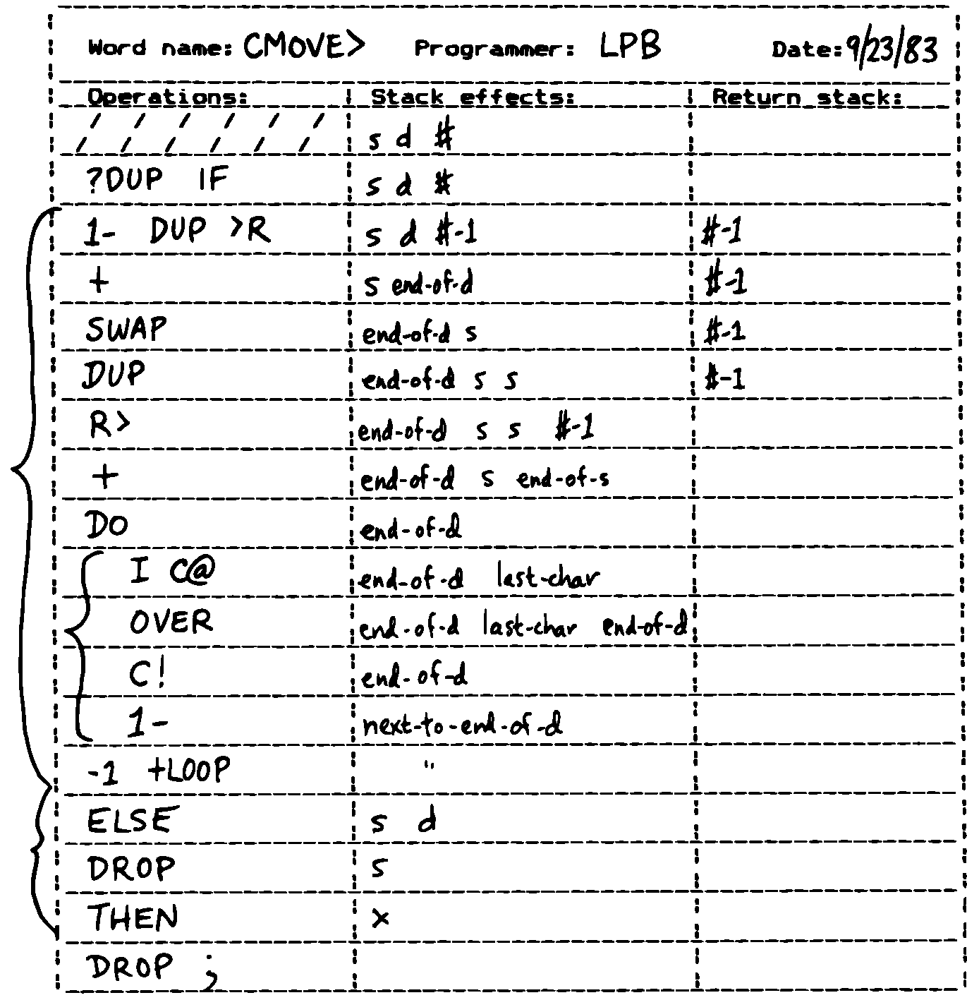
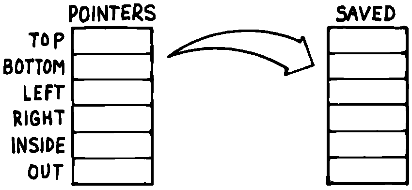

***********************************
7. Handling Data: Stacks and States
***********************************

Forth handles data in one
of two ways: either on the stack or in data structures. When to use
which approach and how to manage both the stack and data structures are
the topics of this chapter.

The Stylish Stack
=================

The simplest way for Forth words to pass arguments to each other is via
the stack. The process is “simple” because all the work of pushing and
popping values to and from the stack is implicit.

**Moore**:
    The data stack uses this idea of "hidden information." The arguments
    being passed between subroutines are not explicit in the calling sequence.
    The same argument might ripple through a whole lot of words quite invisibly,
    even below the level of awareness of the programmer, simply because it
    doesn't have to be referred to explicitly.

One important result of this approach: Arguments are unnamed. They
reside on the stack, not in named variables. This effect is one of the
reasons for Forth’s elegance. At the same time it’s one of the reasons
badly written Forth code can be unreadable. Let’s explore this paradox.

The invention of the stack is analogous to that of pronouns in English.
Consider the passage:

   Take this gift, wrap it in tissue paper and put it in a box.

Notice the word “gift” is mentioned only once. The gift is referred to
henceforth as “it.”

The informality of the “it” construct makes English more readable
(provided the reference is unambiguous). So with the stack, the implicit
passing of arguments makes code more readable. We emphasize the
*processes*, not the *passing of arguments* to the processes.

Our analogy to pronouns suggests why bad Forth can be so unreadable. The
spoken language gets confusing when too many things are referred to with
pronouns.

    Take off the wrapping and open the box. Remove the gift and throw it
    away.

The problem with this passage is that we’re using “it” to refer to too
many things at once. There are two solutions to this error. The easiest
solution is to supply a real name instead of “it”:

    Remove the wrapping and open the box. Take out the gift and throw
    **the box** away.

Or we can introduce the words “former” and “latter.” But the best
solution is to redesign the passage:

    Remove the wrapping and open the present. Throw away the box.

So in Forth we have analogous observations:

.. hint::

   Simplify code by using the stack. But don't stack too deeply within any
   single definition. Redesign, or, as a last resort, use a named variable.

Some newcomers to Forth view the stack the way a gymnast views a
trampoline: as a fun place to bounce around on. But the stack is meant
for data-passing, not acrobatics.

So how deep is “too deep?”
Generally, three elements on the stack is the most you can manage within
a single definition. (In double-length arithmetic, each “element”
occupies two stack positions but is logically treated as a single
element by operators such as ``2DUP``, ``2OVER``, etc.)

In your ordinary lexicon of stack operators, ``ROT``
is the only one that gives you access to the third stack item. Aside
from ``PICK`` and ``ROLL`` (which
we’ll comment on soon), there’s no easy way to get at anything below
that.

To stretch our analogy to the limit, perhaps three elements on the stack
corresponds to the three English pronouns “this,” “that,” and
“t’other.”

Redesign
--------

Let’s witness a case where a wrong-headed approach leads to a messy
stack problem. Suppose we’re trying to write the definition of +THRU
(see :doc:`Chapter Five<chapter5>`, “Listing Organization” section, “Relative Loading” subsection). We’ve decided that our loop body will be

.. code-block:: none
   
   ...  DO  I LOAD  LOOP ;

that is, we’ll put ``LOAD`` in a loop, then arrange
for the index and limit to correspond to the absolute screens being
loaded.

On the stack initially we have:

.. code-block:: none
   
   lo hi

where “lo” and “hi” are the *offsets* from ``BLK``.

We need to permute them for ``DO``, like this:

.. code-block:: none
   
   hi+1+blk lo+blk

Our biggest problem is adding the value of ``BLK`` to both offsets.

We’ve already taken a wrong turn but we don’t know it yet. So let’s
proceed. We try:

.. code-block:: none
   
   lo hi
                  BLK @
   lo hi blk
                  SWAP
   lo blk hi
                  OVER
   lo blk hi blk
                  +
   lo blk hi+blk
                  1+
   lo blk hi+blk+1
                  ROT ROT
   hi+blk+1 lo blk
                  +
   hi+blk+1 lo+blk

We made it, but what a mess!

If we’re gluttons for punishment, we might make two more stabs at it
arriving at:

.. code-block:: none
   
   BLK @  DUP ROT + 1+  ROT ROT +

and

.. code-block:: none
   
   BLK @  ROT OVER +  ROT ROT + 1+  SWAP

All three sequences do the same thing, but the code seems to be getting
blurrier, not better.

With experience we learn to recognize the combination ``ROT ROT`` as a
danger sign: the stack is too crowded. Without having to work out the
alternates, we recognize the problem: once we make two copies of “blk,”
we have four elements on the stack.

At this point, the first resort is usually the
return stack:

.. code-block:: none
   
   BLK @  DUP >R  + 1+  SWAP R> +

(See “The Stylish Return Stack,” coming up next.) Here we’ve
``DUP``\ ed “blk,” saving one copy on the return stack
and adding the other copy to “hi.”

Admittedly an improvement. But readable?

Next we think, “Maybe we need a named variable.” Of course, we have one
already: ``BLK``. So we try:

.. code-block:: none
   
   BLK @  + 1+  SWAP BLK @ +

Now it’s more readable, but it’s still rather long, and redundant too.
``BLK @ +`` appears twice.

“``BLK @ +``”? That sounds familiar. Finally our neurons connect.

We look back at the source for ``+LOAD`` just defined:

.. code-block:: none
   
   : +LOAD  ( offset -- )  BLK @ +  LOAD ;

This word, ``+LOAD``, should be doing the work. All we have to write is:

.. code-block:: none
   
   : +THRU  ( lo hi )  1+ SWAP  DO  I +LOAD  LOOP ;

We haven’t created a more efficient version here, because the work of
``BLK @ +`` will be done on every pass of the loop.
But we have created a cleaner, conceptually simpler, and more readable
piece of code. In this case, the inefficiency is unnoticeable because it
only occurs as each block is loaded.

Redesigning, or rethinking the problem, was the path we should have
taken as soon as things got ugly.

Local Variables
---------------

Most of the time problems can
be arranged so that only a few arguments are needed on the stack at any
one time. Occasionally, however, there’s nothing you can do.

Here’s an example of a worst case. Assume you have a word called ``LINE``
which draws a line between any two points, specified as coordinates in
this order:

.. code-block:: none
   
   ( x1 y1 x2 y2)

where :math:`x_1,y_1` represent the :math:`x,y` coordinates for the one
end-point, and :math:`x_2,y_2` represent the opposite end-point.

Now you have to write a box-drawing word called ``[BOX]`` which takes four
arguments in this order:

.. code-block:: none
   
   ( x1 y1 x2 y2)

where x1 y1 represent the :math:`x,y` coordinates for the upper
left-hand corner of the box, and x2 y2 represent the lower right-hand
corner coordinates. Not only do you have four elements on the stack,
they each have to be referred to more than once as you draw lines from
point to point.

Although we’re using the stack to get the four arguments, the algorithm
for drawing a box doesn’t lend itself to the nature of the stack. If
you’re in a hurry, it would probably be best to take the easy way out:

.. code-block:: none
   
   VARIABLE TOP         ( y coordinates top of box)
   VARIABLE LEFT        ( x     "       left side)
   VARIABLE BOTTOM      ( y     "       bottom)
   VARIABLE RIGHT       ( x     "       right side)
   : [BOX]   ( x1 y1 x2 y2)   BOTTOM !  RIGHT !  TOP !  LEFT !
      LEFT @ TOP @  RIGHT @ TOP @  LINE
      RIGHT @ TOP @  RIGHT @ BOTTOM @  LINE
      RIGHT @ BOTTOM @  LEFT @ BOTTOM @  LINE
      LEFT @ BOTTOM @  LEFT @ TOP @  LINE ;

What we’ve done is create four named variables, one for each coordinate.
The first thing ``[BOX]`` does is fill these variables with the arguments
from the stack. Then the four lines are drawn, referencing the
variables. Variables such as these that are used only within a
definition (or in some cases, within a lexicon) are called “local
variables.”

I’ve been guilty many times of playing hotshot, trying to do as much as
possible on the stack rather than define a local variable. There are
three reasons to avoid this cockiness.

First, it’s a pain to code that way. Second, the result is unreadable.
Third, all your work becomes useless when a design change becomes
necessary, and the order of two arguments changes on the stack. The
``DUP``\ s, ``OVER``\ s and ``ROT``\ s weren’t really solving the problem,
just jockeying things into position.

With this third reason in mind, I recommend the following:

.. hint::

   Especially in the design phase, keep on the stack only the arguments you're
   using immediately. Create local variables for any others. (If necessary,
   eliminate the variables during the optimization phase.)

Fourth, if the definition is extremely time-critical, those tricky stack
manipulators, (e.g., ``ROT ROT``) can really eat up
clock cycles. Direct access to variables is faster.

If it’s *really* time-critical, you may need to convert to assembler
anyway. In this case, all your stack problems fly out the door, because
all your data will be referenced either in registers or indirectly
through registers. Luckily, the definitions with the messiest stack
arguments are often the ones written in code. Our ``[BOX]`` primitive is a
case in point. ``CMOVE>`` is another.

The approach we took with ``[BOX]`` certainly beats spending half an hour
juggling items on the stack, but it is by no means the best solution.
What’s nasty about it is the expense of creating four named variables,
headers and all, solely for use within this one routine.

(If you’re target compiling an application that will not require headers
in the dictionary, the only loss will be the 8 bytes in RAM for the
variables. In Forth systems of the future, headers may be separated into
other pages of memory anyway; again the loss will be only 8 bytes.) Let
me repeat: This example represents a worst-case situation, and occurs
rarely in most Forth applications. If words are well-factored, then each
word is designed to do very little. Words that do little generally
require few arguments.

In this case, though, we are dealing with two points each represented by
two coordinates.

Can we change the design? First, ``LINE`` may be *too* primitive a
primitive. It requires four arguments because it can draw lines between
any two points, diagonally, if necessary.

In drawing our box, we may only need perfectly vertical and horizontal
lines. In this case we can write the more powerful, but less specific,
words ``VERTICAL`` and ``HORIZONTAL`` to draw these lines. Each requires only
*three* arguments: the starting position’s x and y, and the length. This
factoring of function simplifies the definition of ``[BOX]``.

Or we might discover that this syntax feels more natural to the user:

.. code-block:: none
   
   10 10 ORIGIN! 30 30 BOX

where ``ORIGIN!`` sets a two-element pointer to the “origin,” the place
where the box will start (the upper left-hand corner). Then ``30 30 BOX``
draws a box 30 units high and 30 units wide, relative to the origin.

This approach reduces the number of stack arguments to BOX as part of
the design.

.. hint::

   When determining which arguments to handle via data structures rather
   than via the stack, choose the arguments that are the more permanent or
   that represent a current state.

On PICK and ROLL
----------------

Some folks like the words ``PICK`` and
``ROLL``. They use these words to access elements from
any level on the stack. We don’t recommend them. For one thing,
``PICK`` and ``ROLL`` encourage the
programmer to think of the stack as an array, which it is not. If you
have so many elements on the stack that you need
``PICK`` and ``ROLL``, those
elements should be in an array instead.

Second, they encourage the programmer to refer to arguments that have
been left on the stack by higher-level, calling definitions without
being explicitly *passed* as arguments. This makes the definition
dependent on other definitions. That’s unstructured—and dangerous.

Finally, the position of an element on the stack depends on what’s above
it, and the number of things above it can change constantly. For
instance, if you have an address at the fourth stack position down, you
can write

.. code-block:: none
   
   4 PICK @

to fetch its contents. But you must write

.. code-block:: none
   
   ( n) 5 PICK !

because with “:math:`n`” on the stack, the address is now in the fifth
position. Code like this is hard to read and harder to modify.

Make Stack Drawings
-------------------

When you do have a cumbersome stack situation to solve, it’s best to
work it out with paper and pencil. Some people even make up forms, such
as the one in :numref:`fig7-1` . Done formally like this
(instead of on the back of your phone bill), stack commentaries serve as
nice auxiliary documentation.

Stack Tips
----------

.. hint::

   Make sure that stack effects balance out under all possible control flows

In the stack commentary for ``CMOVE>`` in
:numref:`fig7-1` , the inner brace represents the contents of
the ``DO``  ``LOOP``. The stack depth
upon exiting the loop is the same as upon entering it: one element.
Within the outer braces, the stack result of the
``IF`` clause is the same as that of the ``ELSE`` clause:
one element left over. (What that
leftover element represents doesn’t matter, as symbolized by the “x”
next to ``THEN``.)

   Example of a stack commentary.

.. hint::

   When doing two things with the same number, perform the function that
   will go underneath first.

For example:

.. code-block:: none
   
   : COUNT  ( a -- a+1 # )  DUP C@  SWAP 1+  SWAP ;

(where you first get the count) is more efficiently written:

.. code-block:: none
   
   : COUNT  ( a -- a+1 # )  DUP 1+  SWAP C@ ;

(where you first compute the address). 

.. hint::

   Where possible, keep the number of return arguments the same in all
   possible cases.

You’ll often find a definition which
does some job and, if something goes wrong, returns an error-code
identifying the problem. Here’s one way the stack interface might be
designed:

.. code-block:: none
   
   ( -- error-code f | -- t)

If the flag is true, the operation was successful. If the flag is false,
it was unsuccessful and there’s another value on the stack to indicate
the nature of the error.

You’ll find stack manipulation easier, though, if you redesign the
interface to look like this:

.. code-block:: none
   
   ( -- error-code | O=no-error)

One value serves both as a flag and (in case of an error) the error
code. Note that reverse-logic is used; non-zero indicates an error. You
can use any values for the error codes except
zero.

The Stylish Return Stack
========================

What about this use of the return stack to hold temporary arguments? Is
it good style or what?

Some people take great offense to its use. But the return stack offers
the simplest solution to certain gnarly stack jams. Witness the
definition of ``CMOVE>`` in the previous section.

If you decide to use the return stack for this purpose, remember that
you are using a component of Forth for a purpose other than that
intended. (See the section called “Sharing Components,” later in this
chapter.)

Here’s some suggestions to keep you from shooting yourself in the foot:

.. hint::

   #. Keep return stack operators symmetrical.
   #. Keep return stack operators symmetrical under all control flow
      conditions.
   #. In factoring definitions, watch out that one part doesn't contain
      one return stack operator, and the other its counterpart.
   #. If used inside a ``DO``  ``LOOP`` , return stack operators
      must be symmetrical within the loop, and ``I`` is no longer valid in
      code bounded by ``>R`` and ``R>``.

For every ``>R`` there must be a ``R>`` in the same definition.
Sometimes the operators
will appear to be symmetrical, but due to the control structure they
aren’t. For instance:

.. code-block:: none
   
   ... BEGIN ... >R ... WHILE ... R> ... REPEAT

If this construction is used in the outer loop of your application,
everything will run fine until you exit (perhaps hours later) when
you’ll suddenly blow up. The problem? The last time through the loop,
the resolving ``R>`` has been skipped.

The Problem With Variables
==========================

Although we handle data of immediate interest on the stack, we depend on
much information tucked away in variables, ready for recurring access. A
piece of code can change the contents of a variable without necessarily
having to know anything about how that data will be used, who will use
it, or when and if it will be used. Another piece of code can fetch the
contents of a variable and use it without knowing where that value came
from.

For every word that pushes a value onto the stack, another word must
consume that value. The stack gives us point-to-point communication,
like the post office.

Variables, on the other hand, can be set by any command and accessed any
number of times—or not at all—by any command. Variables are available
for anyone who cares to look—like graffiti.

Thus variables can be used to reflect the current state of affairs.

Using currentness can simplify problems. In the Roman numeral example of
:doc:`Chapter Four<chapter4>`, we used the variable ``COLUMN#`` to represent
the current
decimal-place; the words ``ONER``, ``FIVER``, and ``TENER`` depended on this
information to determine which type of symbol to display. We didn’t have
to specify both descriptions every time, as in ``TENS ONER``, ``TENS FIVER``,
etc.

On the other hand, currentness adds a new level of complexity. To make
something current we must first define a variable or some type of data
structure. We also must remember to initialize it, if there’s any chance
that part of our code will refer to it before another part has had a
chance to set it.

A more serious problem with variables is that they are not “reentrant.”
On a multi-tasked Forth system, each task which requires local variables
must have its own copies. Forth’s ``USER`` variables
serve this purpose. (See *Starting Forth*, Chapter Nine, “Forth
Geography.”)

Even within a single task, a definition that refers to a variable is
harder to test, verify, and reuse in a different situation than one in
which arguments are passed via the stack.

Suppose we are implementing a word-processor editor. We need a routine
that calculates the number of characters between the current cursor
position and the previous carriage-return/line-feed sequence. So we
write a word that employs a
``DO``   ``LOOP`` starting at the
current position (``CURSOR @``) and ending at the zeroth position, searching
for the line feed character.

Once the loop has found the character sequence, we subtract its relative
address from our current cursor position

.. code-block:: none
   
   its-position CURSOR @  SWAP -

to determine the distance between them.

Our word’s stack effect is:

.. code-block:: none
   
   ( -- distance-to-previous-cr/lf)

But in later coding we find we need a similar word to compute the
distance from an arbitrary character—\ *not* the current cursor
position—to the first previous line-feed character. We end up factoring
out the “``CURSOR @``” and allowing the starting address to be passed as an
argument on the stack, resulting in:

.. code-block:: none
   
   ( starting-position -- distance-to-previous-cr/lf)

By factoring-out the reference to the variable, we made the definition
more useful.

.. hint::

   Unless it involves cluttering up the stack to the point of unreadability,
   try to pass arguments via the stack rather than pulling them out of
   variables.

**Kogge**:
    Most of the modularity of Forth comes from designing and treating
    Forth words as "functions" in the mathematical sense. In my
    experience a Forth programmer usually tries quite hard to avoid
    defining any but the most essential global variables (I have a friend who
    has the sign "Help stamp out variables" above his desk), and tries to
    write words with what is called "referential transparency," i.e., given
    the same stack inputs a word will always give the same stack outputs
    regardless of the more global context in which it is executed.
    
    In fact this property is exactly what we use when we test words in
    isolation.  Words that do not have this property are significantly harder
    to test. In a sense a "named variable" whose value changes frequently is
    the next worst thing to the now "forbidden" GOTO.

   "Shot from a cannon on a fast-moving train, hurtling between the blades of a windmill, and expecting to grab a trapeze dangling from a hot-air balloon... I told you Ace, there were too many variables!"

Earlier we suggested the use of local variables
especially during the design phase, to eliminate stack traffic. It’s
important to note that in doing so, the variables were referred to only
within the one definition. In our example, ``[BOX]`` receives four arguments
from the stack and immediately loads them into local variables for its
own use. The four variables are not referred to outside of this
definition, and the word behaves safely as a function.

Programmers unaccustomed to a language in which data can be passed
implicitly don’t always utilize the stack as fully as they should.
Michael Ham suggests the reason may
be that beginning Forth users don’t trust the stack
[ham83]_. He admits to initially feeling safer about
storing values into variables than leaving them on the stack. “No
telling *what* might happen with all that thrashing about on the stack,”
he felt.

It took some time for him to appreciate that “if words keep properly to
themselves, using the stack only for their expected input and output and
cleaning up after themselves, they can be looked upon as sealed systems
… I could put the count on the stack at the beginning of the loop, go
through the complete routine for each group, and at the end the count
would emerge, back on top of the stack, not a hair out of
place.”

Local and Global Variables/Initialization
=========================================

As we saw earlier, a variable that is used exclusively within a single
definition (or single lexicon), hidden from other code, is called a
local variable. A variable used by more than one lexicon is called a
global variable. As we’ve seen in an earlier chapter, a set of global
variables that collectively describe a common interface between several
lexicons is called an “interface lexicon.”

Forth makes no distinction between local and global variables. But Forth
programmers do.

**Moore**:
    We should be writing for the reader. If something is referred to only
    locally, a temporary variable just for accumulating a sum in, we should
    define it locally. It's handier to define it in the block where it's used,
    where you can see its comment.
    
    If it's used globally, we should collect things according to their logical
    function, and define them together on a separate screen. One per line with
    a comment.
    
    The question is, where do you initialize them? Some say on the same line,
    immediately following its definition. But that messes up the comments, and
    there isn't room for any decent comment. And it scatters the
    initialization all over the application.
    
    I tend to do all my initialization in the load screen. After I've loaded
    all my blocks, I initialize the things that have to be initialized. It
    might also set up color lookup tables or execute some initialization code.
    
    If your program is destined to be target compiled, then it's easy to write
    a word at the point that encompasses all the initialization.
    
    It can get much more elaborate. I've defined variables in ROM where the
    variables were all off in an array in high memory, and the initial values are
    in ROM, and I copy up the initial values at initialization time. But usually
    you're only initializing a few variables to anything other than zero.

Saving and Restoring a State
============================

Variables have the characteristic that when you change their contents,
you clobber the value that was there before. Let’s look at some of the
problems this can create, and some of the things we can do about them.

``BASE`` is a variable
that indicates the current number radix for all numeric input and
output. The following words are commonly found in Forth systems:

.. code-block:: none
   
   : DECIMAL   10 BASE ! ;
   : HEX   16 BASE ! ;

Suppose we’ve written a word that displays a “dump” of memory.
Ordinarily, we work in decimal mode, but we want the dump in
hexadecimal. So we write:

.. code-block:: none
   
   : DUMP  ( a # )
      HEX   ...   ( code for the dump) ... DECIMAL ;

This works—most of the time. But there’s a presumption that we want to
come back to decimal mode. What if it had been working in hexadecimal,
and wants to come back to hexadecimal? Before we change the base to
``HEX``, we have to save its current value. When we’re
done dumping, we restore it.

This means we have to tuck away
the saved value temporarily, while we format the dump. The return stack
is one place to do this:

.. code-block:: none
   
   : DUMP  ( a # )
      BASE @ >R  HEX   ( code for dump)  R> BASE ! ;

If things get too messy, we may have to define a temporary variable:

.. code-block:: none
   
   VARIABLE OLD-BASE
   : DUMP  ( a # )
      BASE @  OLD-BASE !  HEX ( code for dump )
      OLD-BASE @  BASE ! ;

How quickly things get complicated.

In this situation, if both the current and the old version of a variable
belong only to your application (and not part of your system), and if
this same situation comes up more than once, apply a technique of
factoring:

.. code-block:: none
   
   : BURY  ( a)  DUP 2+  2 CMOVE ;
   : EXHUME  ( a)  DUP 2+  SWAP 2 CMOVE ;

Then instead of defining two variables, such as ``CONDITION`` and
``OLD-CONDITION``, define one double-length variable:

.. code-block:: none
   
   2VARIABLE CONDITION

Use ``BURY`` and ``EXHUME`` to save and restore the original value:

.. code-block:: none
   
   : DIDDLE    CONDITION BURY  17 CONDITION !  ( diddle )
      CONDITION EXHUME ;

``BURY`` saves the “old” version of condition at ``CONDITION 2+``.

You still have to be careful. Going back to our
``DUMP`` example, suppose you decided to add the
friendly feature of letting the user exit the dump at any time by
pressing the “escape” key. So inside the loop you build the test for a
key being pressed, and if so execute ``QUIT``. But
what happens?

The user starts in decimal, then types ``DUMP``. He
exits ``DUMP`` midway through and finds himself,
strangely, in hexadecimal.

In the simple case at hand, the best solution is to not use
``QUIT``, but rather a controlled exit from the loop
(via ``LEAVE``, etc.) to the end of the definition
where ``BASE`` is reset.

In very complex applications a controlled exit is often impractical, yet
many variables must somehow be restored to a natural condition.

**Moore** responds to this example:
    You really get tied up in a knot. You're creating problems for
    yourself. If I want a hex dump I say ``HEX``   ``DUMP``. If I
    want a decimal dump I say ``DECIMAL``   ``DUMP``. I don't give
    ``DUMP`` the privilege of messing around with my environment.
    
    There's a philosophical choice between restoring a situation when you
    finish and establishing the situation when you start. For a long time I felt
    you should restore the situation when you're finished. And I would try to
    do that consistently everywhere. But it's hard to define "everywhere." So
    now I tend to establish the state before I start.
    
    If I have a word which cares where things are, it had better set them. If
    somebody else changes them, they don't have to worry about resetting
    them.
    
    There are more exits than there are entrances.

In cases in which I need to do the resetting before I’m done, I’ve found
it useful to have a single word (which I call ``PRISTINE``) to perform this
resetting. I invoke ``PRISTINE``:

-  at the normal exit point of the application

-  at the point where the user may deliberately exit (just before ``QUIT``)

-  at any point where a fatal error may occur, causing an abort.

Finally, when you encounter this situation of having to save/restore a
value, make sure it’s not just a case of bad factoring. For example,
suppose we have written:

.. code-block:: none
   
   : LONG   18 #HOLES ! ;
   : SHORT   9 #HOLES ! ;
   : GAME   #HOLES @  O DO  I HOLE PLAY  LOOP ;

The current ``GAME`` is either ``LONG`` or ``SHORT``.

Later we decide we need a word to play *any* number of holes. So we
invoke ``GAME`` making sure not to clobber the current value of ``#HOLES``:

.. code-block:: none
   
   : HOLES  ( n)  #HOLES @  SWAP #HOLES !  GAME  #HOLES ! ;

Because we needed ``HOLES`` after we’d defined ``GAME``, it seemed to be of
greater complexity; we built ``HOLES`` around ``GAME``. But in fact—perhaps you
see it already—rethinking is in order:

.. code-block:: none
   
   : HOLES ( n)  O DO  I HOLE PLAY  LOOP ;
   : GAME   #HOLES @ HOLES ;

We can build ``GAME`` around ``HOLES`` and avoid all this saving/restoring
nonsense.

Application Stacks
==================

In the last section we examined some ways to save and restore a single
previous value. Some applications require *several* values to be saved
and restored. You may often find the best solution to this problem in
defining your own stack.

Here is the code for a user stack including very simple error checking
(an error clears the stack):

.. code-block:: none
   
   CREATE STACK  12 ALLOT  \  { 2tos-pointer | 10stack [5 cells] }
   HERE CONSTANT STACK>
   : INIT-STACK   STACK STACK ! ;   INIT-STACK
   : ?BAD  ( ?)   IF ." STACK ERROR "  INIT-STACK  ABORT  THEN ;
   : PUSH  ( n)   2 STACK +!  STACK @  DUP  STACK> = ?BAD  ! ;
   : POP  ( -- n)  STACK @ @  -2 STACK +!  STACK @ STACK < ?BAD ;

The word ``PUSH`` takes a value from off of your data stack and “pushes” it
onto this new stack. ``POP`` is the opposite, “popping” a value from off the
new stack, and onto Forth’s data stack.

In a real application you might want to change the names ``PUSH`` and ``POP`` to
better match their conceptual purposes.

Sharing Components
==================

.. hint::

   It's legal to use a component for an additional purpose besides its
   intended one, provided:
   
   #. All uses of the component are mutually exclusive
   #. Each interrupting use of the component restores the component to
      its previous state when finished.
   
   Otherwise you need an additional component or level of complexity.

We’ve seen a simple example
of this principle with the return stack. The return stack is a component
of the Forth system designed to hold return addresses, and thereby serve
as an indication of where you’ve been and where you’re going. To use the
return stack as a holder for temporary values is possible, and in many
cases desirable. Problems occur when one of the above restrictions is
ignored.

In my text formatter the output can go invisible. This feature has two
purposes:

#. for looking ahead to see whether something will fit, and

#. for formatting the table of contents (the entire document is
   formatted and page numbers are calculated without anything actually
   being displayed).

It was tempting to think that once having added the ability to make the
output invisible, I could use this feature to serve both purposes.
Unfortunately, the two purposes are not mutually exclusive.

Let’s see what would happen if I tried to violate this rule. Imagine
that the word ``DISPLAY`` does the output, and it’s smart enough to know
whether to be visible or invisible. The words ``VISIBLE`` and ``INVISIBLE`` set
the state respectively.

My code for looking ahead will first execute ``INVISIBLE``, then test-format
the upcoming text to determine its length, and finally execute ``VISIBLE``
to restore things to the normal state.

This works fine.

Later I add the table-of-contents feature. First the code executes
``IN-VI-SI-BLE``, then runs
through the document determining page numbers etc.; then finally
executes ``VISIBLE`` to restore things to normal.

The catch? Suppose I’m running a table of contents and I hit one of
those places where I look ahead. When I finish looking ahead, I execute
``VISIBLE``. Suddenly I start printing the document when I was supposed to
be running the table of contents.

The solution? There are several.

One solution views the problem as being that the lookahead code is
clobbering the visible/invisible flag, which may have been preset by
table-of-contents. Therefore, the lookahead code should be responsible
for saving, and later restoring, the flag.

Another solution involves keeping two separate variables—one to indicate
we’re looking ahead, the other to indicate we’re printing the table of
contents. The word ``DISPLAY`` requires that both flags be false in order to
actually display anything.

There are two ways to accomplish the latter approach, depending on how
you want to decompose the problem. First, we could nest one condition
within the other:

.. code-block:: none
   
   : [DISPLAY]  ...
        ( the original definition, always does the output) ... ;
   VARIABLE 'LOOKAHEAD?  ( t=looking-ahead)
   : <DISPLAY>   'LOOKAHEAD? @ NOT IF  [DISPLAY]  THEN ;
   VARIABLE 'TOC?  ( t=setting-table-of-contents)
   : DISPLAY   'TOC? @ NOT IF  <DISPLAY>  THEN ;

``DISPLAY`` checks that we’re not setting the table of
contents and invokes ``<DISPLAY>``, which in turn checks that we’re not
looking ahead and invokes ``[DISPLAY]``.

In the development cycle, the word ``[DISPLAY]`` that always does the output
was originally called ``DISPLAY``. Then a new ``DISPLAY`` was defined to include
the lookahead check, and the original definition was renamed ``[DISPLAY]``,
thus adding a level of complexity backward without changing any of the
code that used ``DISPLAY``.

Finally, when the table-of-contents feature was added, a new ``DISPLAY`` was
defined to include the table-of-contents check, and the previous ``DISPLAY``
was renamed ``<DISPLAY>``.

That’s one approach to the use of two variables. Another is to include
both tests within a single word:

.. code-block:: none
   
   : DISPLAY   'LOOKAHEAD? @  'TOC @ OR  NOT IF [DISPLAY] THEN ;

But in this particular case, yet another approach can simplify the whole
mess. We can use a single variable not as a flag, but as a counter.

We define:

.. code-block:: none
   
   VARIABLE 'INVISIBLE?  ( t=invisible)
   : DISPLAY   'INVISIBLE? @  O= IF [DISPLAY] THEN ;
   : INVISIBLE   1 'INVISIBLE? +! ;
   : VISIBLE    -1 'INVISIBLE? +! ;

The lookahead code begins by invoking ``INVISIBLE`` which bumps the counter
up one. Non-zero is “true,” so ``DISPLAY`` will not do the output. After the
lookahead, the code invokes ``VISIBLE`` which decrements the counter back to
zero (“false”).

The table-of-contents code also begins with ``VISIBLE`` and ends with
``IN-VI-SI-BLE``. If we’re running
the table of contents while we come upon a lookahead, the second
invocation of ``VISIBLE`` raises the counter to two.

The subsequent invocation of ``INVISIBLE`` decrements the counter to one, so
we’re still invisible, and will remain invisible until the table of
contents has been run.

(Note that we must substitute ``0=`` for
``NOT``. The ’83 Standard has changed
``NOT`` to mean one’s complement, so that
``1 NOT`` yields true. By the way, I think this was a
mistake.)

This use of a counter may be dangerous, however. It requires parity of
command usage: two ``VISIBLE``\ s yields invisible. That is, unless ``VISIBLE``
clips the counter:

.. code-block:: none
   
   : VISIBLE   'INVISIBLE? @  1-  O MAX  'INVISIBLE? ! ;

The State Table
===============

A single variable can express a single condition, either a flag, a
value, or the address of a function.

A collection of conditions together represent the *state* of the
application or of a particular component [slater83]_.
Some applications require the ability to save a current state, then
later restore it, or perhaps to have a number of alternating states.

.. hint::

   When the application requires handling a group of conditions
   simultaneously, use a state table, not separate variables.

The simple case requires saving and restoring a
state. Suppose we initially have six variables representing the state of
a particular component, as shown in :numref:`fig7-2`.

.. code-block:: none
   :caption: A collection of related variables.
   :name: fig7-2
   
   VARIABLE TOP
   VARIABLE BOTTOM
   VARIABLE LEFT
   VARIABLE RIGHT
   VARIABLE INSIDE
   VARIABLE OUT

Now suppose that we need to save all of them, so
that further processing can take place, and later restore all of them.
We could define:

.. code-block:: none
   
   : @STATE ( -- top bottom left right inside out)
      TOP @  BOTTOM @  LEFT @  RIGHT @  INSIDE @  OUT @ ;
   : !STATE ( top bottom left right inside out -- )
      OUT !  INSIDE !  RIGHT !  LEFT !  BOTTOM !  TOP ! ;

thereby saving all the values on the stack until it’s time to restore
them. Or, we might define alternate variables for each of the variables
above, in which to save each value separately.

But a preferred technique involves creating a table, with each element
of the table referred to by name. Then creating a second table of the
same length. As you can see in :numref:`fig7-3`, we can save
the state by copying the table, called ``POINTERS,`` into the second table,
called SAVED.

   Conceptual model for saving a state table.

We’ve implemented this approach with the code in :numref:`fig7-4`.

.. code-block:: none
   :caption: Implementation of save/restorable state table.
   :name: fig7-4
   
   0 CONSTANT POINTERS  \ address of state table PATCHED LATER
   : POSITION   ( o -- o+2 ) CREATE DUP ,  2+
      DOES>  ( -- a )  @  POINTERS + ;
   0  \ initial offset
   POSITION TOP
   POSITION BOTTOM
   POSITION LEFT
   POSITION RIGHT
   POSITION INSIDE
   POSITION OUT
   CONSTANT /POINTERS   \ final computed offset
   
   HERE ' POINTERS >BODY !  /POINTERS ALLOT  \ real table
   CREATE SAVED  /POINTERS ALLOT  \ saving place
   : SAVE     POINTERS  SAVED  /POINTERS CMOVE ;
   : RESTORE  SAVED  POINTERS  /POINTERS CMOVE ;

Notice in this implementation that the names of the pointers, ``TOP``,
``BOTTOM``, etc., always return the same address. There is only one location
used to represent the current value of any state at any time.

Also notice that we define ``POINTERS`` (the name of the table) with
``CON-STANT``, not with ``CREATE``, using a dummy value of zero.
This is because we refer to ``POINTERS`` in the defining word ``POSITION``, but
it’s not until after we’ve defined all the field names that we know how
big the table must be and can actually ``ALLOT`` it.

As soon as we create the field names, we define the size of the table as
a constant ``/POINTERS``. At last we reserve room for the table itself,
patching its beginning address (``HERE``) into the constant ``POINTERS``. (The
word ``>BODY`` converts the address returned by tick
into the address of the constant’s value.) Thus ``POINTERS`` returns the
address of the table allotted later, just as a name defined by ``CREATE``
returns the address of a table allotted directly below the name’s
header.

Although it’s valid to patch the value of a ``CONSTANT`` at compile time, as
we do here, there is a restriction of style:

.. hint::

   A ``CONSTANT``\ s value should never be changed once the application is
   compiled.

The case of alternating states is slightly more involved. In this
situation we need to alternate back and forth between two (or more)
states, never clobbering the conditions in each state when we jump to
the other state. :numref:`fig7-5` shows the conceptual model
for this kind of state table.

.. figure:: fig7-5.png
   :name: fig7-5
   :alt: Conceptual model for alternating-states tables.

   Conceptual model for alternating-states tables.

In this model, the names ``TOP``, ``BOTTOM``, etc., can be
made to point into either of two tables, ``REAL`` or ``PSEUDO``. By making the
``REAL`` table the current one, all the pointer names reference addresses in
the ``REAL`` table; by making the ``PSEUDO`` table current, they address the
``PSEUDO`` table.

The code in :numref:`fig7-6` implements this alternating states
mechanism. The words ``WORKING`` and ``PRETENDING`` change the pointer
appropriately. For instance:

.. code-block:: none
   :caption: Implementation of alternating-states mechanism.
   :name: fig7-6
   
   VARIABLE 'POINTERS  \ pointer to state table
   : POINTERS ( -- adr of current table)   'POINTERS @ ;
   : POSITION   ( o -- o+2 ) CREATE DUP ,  2+
      DOES>  ( -- a )  @ POINTERS + ;
   0  \ initial offset
   POSITION TOP
   POSITION BOTTOM
   POSITION LEFT
   POSITION RIGHT
   POSITION INSIDE
   POSITION OUT
   CONSTANT /POINTERS  \ final computed offset
   CREATE REAL    /POINTERS ALLOT  \ real state table
   CREATE PSEUDO  /POINTERS ALLOT  \ temporary state table
   : WORKING      REAL 'POINTERS ! ;     WORKING
   : PRETENDING   PSEUDO 'POINTERS ! ;

.. code-block:: none
   
   WORKING
   10 TOP !
   TOP &underline{? 10}
   PRETENDING
   20 TOP !
   TOP &underline{? 20}
   WORKING
   TOP &underline{? 10}
   PRETENDING
   TOP &underline{? 20}

The major difference with this latter approach is that names go through
an extra level of indirection (``POINTERS`` has been changed from a constant
to a colon definition). The field names can be made to point to either
of two state tables. Thus each name has slightly more work to do. Also,
in the former approach the names refer to fixed locations; a
``CMOVE`` is required each time we save or restore the
values. In this approach, we have only to change a single pointer to
change the current table.

Vectored Execution
==================

Vectored execution extends the ideas of currentness and indirection
beyond data, to functions. Just as we can save values and flags in
variables, we can also save functions, because functions can be referred
to by address.

The traditional techniques for implementing vectored execution are
described in *Starting Forth*, Chapter Nine. In this section we’ll
discuss a new syntax which I invented and which I think can be used in
many circumstances more elegantly than the traditional methods.

The syntax is called ``DOER/MAKE``. (If
your system doesn’t include these words, refer to :doc:`Appendix B<appendixb>`
for code and implementation details.) It works like this: You define the
word whose behavior will be vectorable with the defining word
``DOER``, as in

.. code-block:: none
   
   DOER PLATFORM

Initially, the new word ``PLATFORM`` does nothing. Then you can write words
that change what ``PLATFORM`` does by using the word ``MAKE``:

.. code-block:: none
   
   : LEFTWING   MAKE PLATFORM  ." proponent " ;
   : RIGHTWING  MAKE PLATFORM  ." opponent " ;

When you invoke ``LEFTWING``, the phrase ``MAKE PLATFORM`` changes what
``PLATFORM`` will do. Now if you type ``PLATFORM``, you’ll see:

.. code-block:: none
   
   LEFTWING ok
   PLATFORM proponent ok

``RIGHTWING`` will make ``PLATFORM`` display “opponent.” You can use
``PLATFORM`` within another definition:

.. code-block:: none
   
   : SLOGAN   ." Our candidate is a longstanding " PLATFORM
      ." of heavy taxation for business. " ;

The statement

.. code-block:: none
   
   LEFTWING SLOGAN

will display one campaign statement, while

.. code-block:: none
   
   RIGHTWING SLOGAN

will display another.

The ``MAKE`` code can be any Forth code, as much or as long as you want;
just remember to conclude it with semicolon. The semicolon at the end of
``LEFTWING`` serves for both ``LEFTWING`` and for the bit of code after ``MAKE``.
When ``MAKE`` redirects execution of the ``DOER`` word, it
also *stops* execution of the word in which it appears.

When you invoke ``LEFTWING``, for example, ``MAKE`` redirects ``PLATFORM`` and
exits. Invoking ``LEFTWING`` does not cause “proponent” to be printed.
:numref:`fig7-7`  demonstrates this point, using a
conceptualized illustration of the dictionary.

   ``DOER`` and ``MAKE``.

If you want to *continue* execution, you can use the word
``;AND`` in place of semicolon.
``;AND`` terminates the code that the
``DOER`` word points to, and resumes execution of the
definition in which it appears, as you can see in :numref:`fig7-8` .

   Multiple ``MAKE``\ s in parallel using ``;AND``.

Finally, you can chain the “making” of ``DOER`` words
in series by not using ``;AND``.
:numref:`fig7-9`  explains this better than I could write about it.

   Multiple ``MAKE``\ s in series.

Using DOER/MAKE
===============

There are many occasions when the ``DOER/MAKE`` construct proves beneficial.
They are:

#. To change the state of a function (when external testing of the state
   is not necessary). The words ``LEFTWING`` and ``RIGHTWING`` change the state
   of the word ``PLATFORM``.

#. To factor out internal phrases from similar definitions, but within
   control structures such as loops.
   
   Consider the definition of a word called ``DUMP``, designed to reveal the
   contents of a specified region of memory.
   
   .. code-block:: none
   
      : DUMP  ( a # )
         O DO  I 16 MOD O= IF  CR  DUP I +  5 U.R  2 SPACES  THEN
         DUP I +  &poorbf{@ 6 U.R  2 +LOOP}  DROP ;
   
   The problem arises when you write a definition called ``CDUMP``, designed
   to format the output according to bytes, not cells:
   
   .. code-block:: none
   
      : CDUMP  ( a # )
         O DO  I 16 MOD O= IF  CR  DUP I +  5 U.R  2 SPACES  THEN
         DUP I +  &poorbf{C@  4 U.R  LOOP} DROP ;
   
   The code within these two definitions is identical except for the
   fragments in boldface. But factoring is difficult because the
   fragments occur inside the    ``DO``  ``LOOP``.
   
   Here’s a solution to this problem, using ``DOER/MAKE``. The code that
   changes has been replaced with the word ``.UNIT``, whose behavior is
   vectored by the code in ``DUMP`` and ``CDUMP``. (Recognize that
   “``1``  ``+LOOP``” has the same effect as “``LOOP``”.)
   
   .. code-block:: none
   
      DOER .UNIT ( a -- increment)  \ display byte or cell
      : <DUMP>  ( a # )
         O DO  I 16 MOD O= IF  CR  DUP I +  5 U.R  2 SPACES  THEN
         DUP I + &poorbf{.UNIT}  +LOOP  DROP ;
      : DUMP   ( a #)  MAKE .UNIT  @  6 U.R  2 ;AND <DUMP> ;
      : CDUMP ( a #)   MAKE .UNIT C@  4 U.R  1 ;AND <DUMP> ;
   
   Notice how ``DUMP`` and ``CDUMP`` *set-up* the vector, then go on to
   *execute* the shell (the word ``<DUMP>``).

#. To change the state of related functions by invoking a single
   command. For instance:

   .. code-block:: none
   
      DOER TYPE'
      DOER EMIT'
      DOER SPACES'
      DOER CR'
      : VISIBLE     MAKE TYPE'  TYPE ;AND
                    MAKE EMIT'  EMIT ;AND
                    MAKE SPACES'  SPACES ;AND
                    MAKE CR'  CR ;
      : INVISIBLE   MAKE TYPE'  2DROP ;AND
                    MAKE EMIT'  DROP ;AND
                    MAKE SPACES'  DROP ;AND
                    MAKE CR'  ;
   
   Here we’ve defined a vectorable set of output words, each name having
   a “prime” mark at the end. ``VISIBLE`` sets them to their expected
   functions. ``INVISIBLE`` makes them no-ops, eating up the arguments that
   would normally be passed to them. Say ``INVISIBLE`` and any words defined
   in terms of these four output operators will *not* produce any
   output.

#. To change the state for the next occurrence only, then change the
   state (or reset it) again.
   
   Suppose we’re writing an adventure game. When the player first
   arrives at a particular room, the game will display a detailed
   description. If the player returns to the same room later, the game
   will show a shorter message.

   We write:

   .. code-block:: none
   
      DOER ANNOUNCE
      : LONG MAKE ANNOUNCE
         CR ." You're in a large hall with a huge throne"
         CR ." covered with a red velvet canopy."
               MAKE ANNOUNCE
         CR ." You're in the throne room." ;
   
   The word ``ANNOUNCE`` will display either message. First we say ``LONG``, to
   initialize ``ANNOUNCE`` to the long message. Now we can test ``ANNOUNCE``,
   and find that it prints the long message. Having done that, however,
   it continues to “make” ``ANNOUNCE`` display the short message.
   
   If we test ``ANNOUNCE`` a second time, it prints the short message. And
   it will for ever more, until we say ``LONG`` again.
   
   In effect we’re queuing behaviors. We can queue any number of
   behaviors, letting each one set the next. The following example
   (though not terribly practical) illustrates the point.

   .. code-block:: none
   
      DOER WHERE
      VARIABLE SHIRT
      VARIABLE PANTS
      VARIABLE DRESSER
      VARIABLE CAR
      
      : ORDER  \  specify search order
         MAKE WHERE  SHIRT   MAKE WHERE  PANTS
         MAKE WHERE  DRESSER   MAKE WHERE CAR
         MAKE WHERE  O ;
      
      : HUNT  ( -- a|O )  \  find location containing 17
         ORDER  5 O DO  WHERE  DUP O=  OVER @  17 =  OR  IF
            LEAVE  ELSE  DROP  THEN  LOOP ;
   
   In this code we’ve created a list of variables, then defined an ``ORDER``
   in which they are to be searched. The word ``HUNT`` looks through each of
   them, looking for the first one that contains a 17. ``HUNT`` returns
   either the address of the correct variable, or a zero if none have
   the value.
   
   It does this by simply executing ``WHERE`` five times. Each time, ``WHERE``
   returns a different address, as defined in ``ORDER``, then finally zero.
   
   We can even define a ``DOER`` word that toggles its
   own behavior endlessly:

   .. code-block:: none
   
      DOER SPEECH
      : ALTERNATE
         BEGIN  MAKE SPEECH ." HELLO "
         MAKE SPEECH ." GOODBYE "
         O UNTIL ;

#. To implement a forward reference. A forward reference is usually
   needed as a “hook,” that is, a word invoked in a low-level definition
   but reserved for use by a component defined later in the listing.
   
   To implement a forward reference, build the header of the word with
   ``DOER``, before invoking its name.

   .. code-block:: none
   
      DOER STILL-UNDEFINED
   
   Later in the listing, use ``MAKE``;
   
   .. code-block:: none
   
      MAKE STILL-UNDEFINED  ALL THAT JAZZ ;
   
   (Remember, ``MAKE`` can be used outside a colon definition.)

#. Recursion, direct or indirect.
   
   Direct recursion occurs when a word invokes itself. A good example is
   the recursive definition of greatest-common-denominator:
   
   .. code-block:: none
   
      GCD of a, b =  a                     if b = O
                     GCD of b, a mod b     if b > O
   
   This translates nicely into:

   .. code-block:: none
   
      DOER GCD ( a b -- gcd)
      MAKE GCD  ?DUP  IF  DUP ROT ROT  MOD  GCD  THEN ;
   
   Indirect recursion occurs when one word invokes a second word, while
   the second word invokes the first. This can be done using the form:

   .. code-block:: none
   
      DOER B
      : A  ... B ... ;
      MAKE B  ... A ... ;

#. Debugging. I often define:
   
   .. code-block:: none
      
      DOER SNAP
   
   (short for ``SNAPSHOT``), then edit ``SNAP`` into my application at a point
   where I want to see what’s going on. For instance, with ``SNAP`` invoked
   inside the main loop of a keystroke interpreter, I can set it up to
   let me watch what’s happening to a data structure as I enter keys.
   And I can change what SNAP does without having to recompile the loop.

..
   
The situations in which it’s preferable to use the tick-and-execute
approach are those in which you need control over the address of the
vector, such as when vectoring through an element in a decision table,
or attempting to save/restore the contents of the vector.

Summary
=======

In this chapter we’ve examined the tradeoffs between using the stack and
using variables and other data structures. Using the stack is preferable
for testing and reusability, but too many values manipulated on the
stack by a single definition hurts readability and writeability.

We also explored techniques for saving and restoring data structures,
and concluded with a study of vectored execution using
``DOER/MAKE``.

REFERNCES
=========

.. [ham83]  Michael Ham, "Why Novices Use So Many Variables,"    **Forth Dimensions** , vol. 5, no. 4, November/December 1983.
.. [slater83]  Daniel Slater, "A State Space Approach to   Robotics,"  **The Journal of Forth Application and Research** ,   1, 1 (September 1983), 17.
